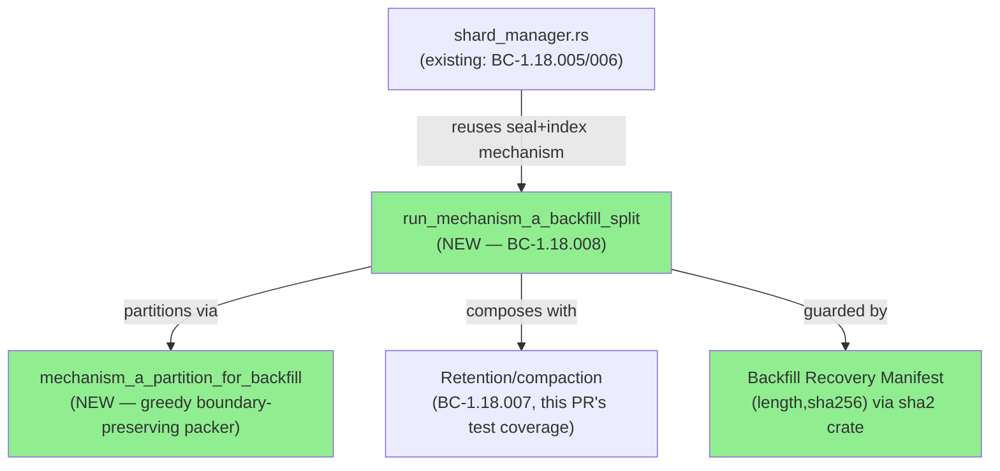
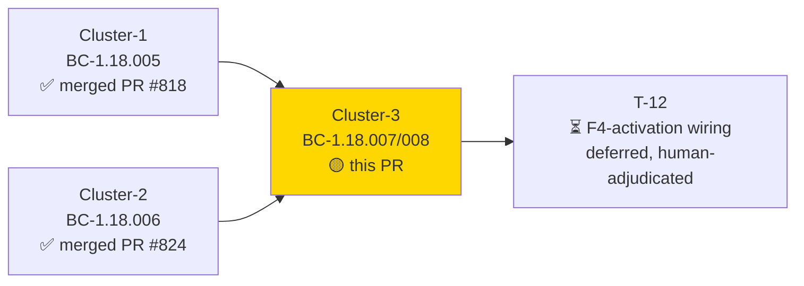
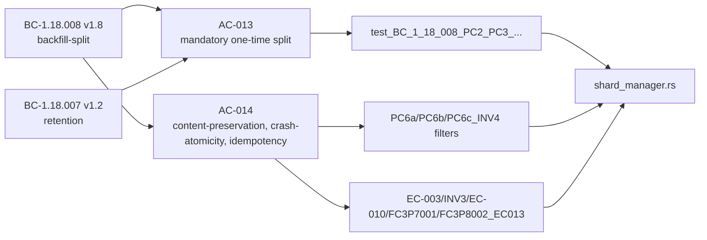
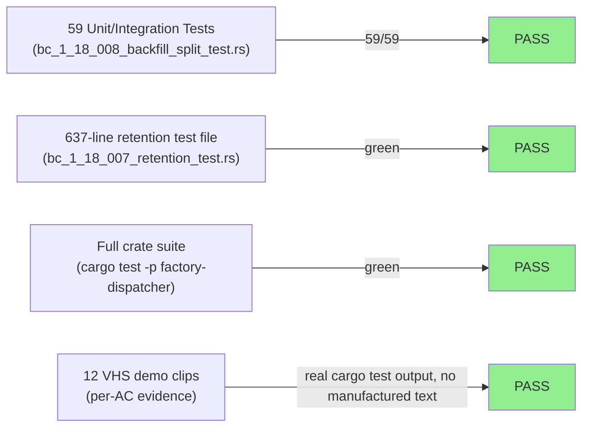
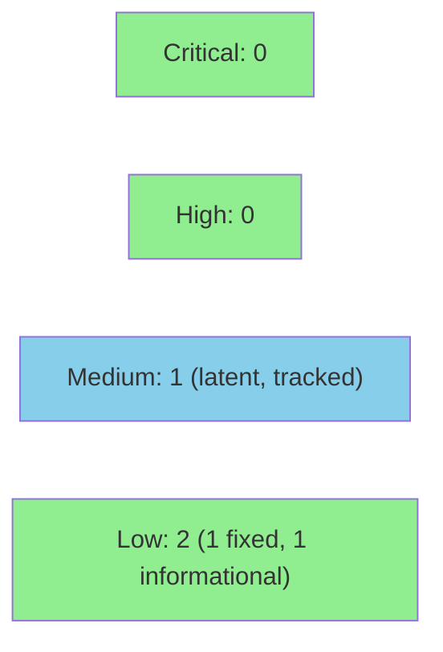

# [S-25.02] Artifact Sharding Layer 2 — Cluster 3: Mechanism-A One-Time Backfill-Split

**Epic:** S-25.02 — Artifact Sharding Layer 2 (BC-1.18.001..012)
**Mode:** feature (Feature Mode F4, cycle `v1.0-brownfield-backfill`)
**Convergence:** BC-5.39.001 3-CLEAN LOCAL streak achieved pre-PR (adversary passes 12/13/14) after 14 cluster-3 adversarial passes total (13 LOCAL + 1 cross-vendor Codex pass at pass-6, which caught a real data-loss defect — see Adversarial Review below). **PR-level review cycle 1 found 1 genuine new BLOCKING cross-mechanism defect** (Backfill Recovery Manifest did not survive an ordinary BC-1.18.006 roll) — resolved via BC-1.18.008 v1.9 spec amendment + code fix + 2 new regression tests (EC-014/EC-015). See "PR-Level Review" below. Re-review requested.

## PR-Level Review

**Cycle 1 verdict:** REQUEST_CHANGES (pr-reviewer, fresh-eyes) — 1 BLOCKING, 5 SUGGESTIONs, 3 NITs. Full review posted to PR #831; triage table posted as a PR comment.

**BLOCKING-1 — resolved this cycle.** The Backfill Recovery Manifest was a side-channel TOML table, not a `ShardIndex` struct field, so BC-1.18.006's already-merged, already-live ongoing roll mechanism silently destroyed it on the first roll after a backfill — permanently stranding the one-time migration in a fail-loud `MissingBackfillManifest`/`E-SHD-011` state on exactly the artifacts it exists to fix. Resolution (BC-1.18.008 → v1.9, product-owner adjudicated):
- `backfill_manifest: Option<BackfillManifest>` promoted to a real, additive `ShardIndex` struct field (same pattern as `retention_count`) — survives every future index write automatically.
- Idempotency basis redefined from bare index-existence to `backfill_manifest.is_some()`.
- New Composability clause: the split now tolerates a pre-existing non-empty shard set from a prior roll (roll-before-backfill ordering), appending its own shards after the existing max seq.
- New EC-014 (manifest survives an intervening roll) and EC-015 (roll-before-backfill tolerance), each with 2 new regression tests.
- Error-taxonomy v1.14: the previously-fabricated "Invariant 3(c)" citation for `E-SHD-011` form (b) replaced with the real, narrowed Residual-disposition clause; new `E-SHD-002` form (c) documented for the SEC-831-02 fix.
- Code: commits `1cce59b7` (tests) + `a5a80103` (fix). 941/941 tests green, fmt/clippy clean.
- Spec propagation: story AC-013/AC-014 updated, VP-124 sixth facet propagated to VP-INDEX/verification-architecture/verification-coverage-matrix, BC-INDEX synced.

**SUGGESTIONs and NITs — triaged, not fixed this cycle** (see the full triage table posted as a PR comment for rationale on each): SUGGESTION-2/3/4 are real, deeper edge-case/crash-recovery robustness gaps in a mechanism with zero production callers on this branch (same "no F4-activation caller yet" scope boundary already adjudicated as a T-12 deferral). SUGGESTION-5 is the same class (BC-1.18.007 AC-010/AC-012 wiring). SUGGESTION-1 (taxonomy staleness) and NIT-1 (PR description staleness) were fixed as part of this cycle's work. These are surfaced transparently, not silently dropped — human/orchestrator visibility is in this PR's comment thread for a follow-up-story decision.


Implements BC-1.18.008 v1.8 (mandatory one-time backfill-split of the four pre-existing oversized
cycle append-logs — `decision-log.md`, `burst-log.md`, `lessons.md`, `session-checkpoints.md`) and
BC-1.18.007 v1.2 (retention/compaction), covering story AC-013 and AC-014. This is the 3rd of the
S-25.02 cluster sequence: cluster-1 (cap formula + native shard-cap trigger, BC-1.18.005, PR #818)
and cluster-2 (roll, BC-1.18.006, PR #824) are already merged to `develop`. Cluster-3 delivers the
mechanism that actually *shrinks* the four already-oversized artifacts — without it, Layer 2 would
only gate future writes and never retroactively fix the artifacts producing the majority of
observed `plugin.indeterminate` events today.

The backfill-split partitions each monolithic file into `ceil(bytes/cap)`-lower-bound sealed shards
plus a fresh current file via deterministic, greedy, boundary-preserving packing, publishing the
full shard index in the same operation. It composes immediately with BC-1.18.007 retention when the
actual packed shard count exceeds `retention_count`, and is safely re-runnable/idempotent across a
crash at any of its three destructive write sites (sealed-shard write, DANGEROUS-window heal,
happy-path canonical-truncate), each independently disk-read-back-verified.

---

## Architecture Changes



<details>
<summary><strong>Architecture Decision Record</strong></summary>

### ADR: Manifest-authoritative recovery over structural byte-prefix comparison

**Context:** A one-time migration that can crash mid-sequence needs a way to distinguish "never
ran," "completed," and "corrupted/tampered" on re-invocation, without trusting a structural
byte-prefix comparison against already-sealed shard content (which false-positives whenever a
sealed shard's content legitimately recurs as a genuine prefix of the final partition).

**Decision:** Publish a `[backfill_manifest]` table (`original_bytes`/`original_sha256`,
`final_bytes`/`final_sha256`) in the SAME atomic write as the shard index, durable before the
canonical-truncate step. Recovery reads the canonical file's current `(length, SHA-256)` exactly
once and resolves to SAFE / DANGEROUS / AMBIGUOUS by comparing against the manifest's two recorded
pairs — never by re-concatenating sealed shards.

**Rationale:** Exact whole-file identity against a durably-published manifest is unambiguous and
cannot false-positive on content recurrence. `sha2` was added as a new workspace dependency to
compute the hash pairs.

**Alternatives Considered:**
1. Structural byte-prefix comparison against re-concatenated sealed shards — rejected: false-
   positives whenever a shard's content is a genuine prefix of later content (real data-loss bug
   caught by the cross-vendor pass-6/pass-7 adversarial cycles).
2. Deriving the DANGEROUS-window heal offset by summing shard-index `bytes_at_seal` fields —
   rejected: `bytes_at_seal` is an independently-corruptible piece of on-disk state distinct from
   the manifest; a stale/corrupted value yields a silent mis-heal with no verification (the exact
   defect the Manifest-Authoritative Slice-and-Verify Rule, F-C3-P7-001, was added to close).

**Consequences:**
- Every destructive, one-time, source-overwriting write site (sealed-shard write, DANGEROUS heal,
  happy-path canonical-truncate) now gets its own mandatory post-hoc disk read-back verification
  (Invariant 5) — none is trusted on its own return value alone.
- Adds `sha2` to the dependency surface (new workspace dep in `Cargo.toml` +
  `crates/factory-dispatcher/Cargo.toml`).

</details>

---

## Story Dependencies



Cluster-3 reuses cluster-2's seal+create+index-publish mechanism (BC-1.18.006) in a loop against
pre-existing content, and composes with cluster-2's own retention policy (BC-1.18.007) in the same
operation. No dispatcher-gate wiring (`execute_tiers -> ...`) invokes this mechanism yet on this
branch — that one-time-runner activation is scoped to story **T-12**, a human-adjudicated scope
deferral (this cluster delivers the entry point/library mechanism; T-12 wires the caller).

---

## Spec Traceability



| Requirement | Story AC | BC Postcondition | Test | Status |
|-------------|----------|-------------------|------|--------|
| Mandatory one-time split, greedy boundary-preserving packing, preamble handling | AC-013 | BC-1.18.008 PC1-PC3 | `test_BC_1_18_008_PC2_PC3_run_backfill_split_...`, `test_BC_1_18_008_BLOCKER1_run_backfill_split_preserves_preamble_bytes_end_to_end` | PASS |
| Retention composition in same operation | AC-013 | BC-1.18.008 PC4 | `test_BC_1_18_008_PC4_run_backfill_split_composes_with_retention_...` | PASS |
| Content/record-count preservation, per-shard-cap gate | AC-014 | BC-1.18.008 PC5-PC6, Inv4 | `PC6a_verify_content_preserved`, `PC6b_verify_record_counts_preserved`, `PC6c_INV4` filters | PASS |
| Crash-atomicity restart | AC-014 | BC-1.18.008 EC-003 | `test_BC_1_18_008_EC003_run_backfill_split_restart_after_partial_prior_attempt_...` | PASS |
| SAFE-disposition idempotency | AC-014 | BC-1.18.008 Inv3 | `test_BC_1_18_008_INV3_run_backfill_split_idempotent_...` | PASS |
| AMBIGUOUS disposition fail-loud | AC-014 | BC-1.18.008 EC-010, `E-SHD-011` | `test_BC_1_18_008_FC3P6001_EC010_..._e_shd_011` | PASS |
| DANGEROUS-window heal, manifest-authoritative slice-and-verify | AC-014 | BC-1.18.008 EC-011, `E-SHD-012` | `FC3P7001` filter (3 tests) | PASS |
| Happy-path canonical-write read-back | AC-014 | BC-1.18.008 Inv5, EC-013, `E-SHD-013` | `FC3P8002_EC013` filter (2 tests) | PASS |

---

## Test Evidence

### Coverage Summary

| Metric | Value | Status |
|--------|-------|--------|
| Cluster-3 test file (`bc_1_18_008_backfill_split_test.rs`) | 59/59 pass | PASS |
| Full crate suite (`cargo test -p factory-dispatcher`) | 938/938 pass (re-verified after the SEC-831-02 fix, commit `4febaaa7`) | PASS |
| `cargo fmt --check --all` | clean | PASS |
| `cargo clippy --workspace --all-targets -- -D warnings` | clean | PASS |

### Test Flow



<details>
<summary><strong>Detailed Test Results</strong></summary>

| File | Lines | Purpose |
|------|-------|---------|
| `crates/factory-dispatcher/src/shard_manager.rs` | +2,338 | `run_mechanism_a_backfill_split`, `mechanism_a_partition_for_backfill`, Backfill Recovery Manifest, recovery-confirmation + slice-and-verify heal, disk read-back verification at all 3 destructive write sites |
| `crates/factory-dispatcher/tests/bc_1_18_008_backfill_split_test.rs` | +4,036 (new) | 59 tests covering AC-013/AC-014 postconditions, invariants, and edge cases |
| `crates/factory-dispatcher/tests/bc_1_18_007_retention_test.rs` | +637 (new) | Retention/compaction composition coverage |
| `Cargo.toml` / `crates/factory-dispatcher/Cargo.toml` | +14 | New `sha2` workspace dependency for manifest content hashing |

Reproduction commands and the full AC/EC → clip mapping are documented in
`docs/demo-evidence/S-25.02/cluster-3-backfill-split/README.md`.

</details>

---

## Adversarial Review (LOCAL convergence, pre-PR)

| Pass | Reviewer | Findings | Notable | Status |
|------|----------|----------|---------|--------|
| 1-5 | LOCAL Claude adversary | multiple HIGH/MEDIUM | pattern-based record-boundary detection, preamble preservation, self-heal crash window | Fixed |
| 6-7 | Cross-vendor (Codex) + LOCAL | 1 HIGH (data-loss) + MEDIUM | **Real data-loss bug**: structural byte-prefix recovery heuristic false-positives on content recurrence; corrected to Manifest-Authoritative Slice-and-Verify Rule (F-C3-P7-001) | Fixed |
| 8-11 | LOCAL Claude adversary | MEDIUM (doc-staleness ×2) | happy-path canonical-write read-back (F-C3-P8-002/`E-SHD-013`), stale transient-status doc-comment sweep (F-C3-P11-001) | Fixed |
| 12-14 | LOCAL Claude adversary | 0 findings ×3 | 3-CLEAN convergence per BC-5.39.001 | CLEAN |

**Convergence:** BC-5.39.001 3-CLEAN LOCAL streak achieved at code `2dd39bbb` (passes 12/13/14).
`a1328c3f` (branch HEAD) adds only demo evidence on top of the converged code — no code changes
since the 3-CLEAN streak closed. 14 total adversarial passes across the cluster's lifetime,
including the cross-vendor Codex pass that caught the recovery-heuristic data-loss bug above.

<details>
<summary><strong>High-Severity Findings & Resolutions (selected)</strong></summary>

### Finding: Structural byte-prefix recovery heuristic false-positives on content recurrence (F-C3-P6-001/P7-001, HIGH — data loss)
- **Location:** `crates/factory-dispatcher/src/shard_manager.rs` — recovery-confirmation path
- **Category:** correctness / data-loss
- **Problem:** Comparing the canonical file's current bytes against a re-concatenation of already-
  sealed shards can false-positive whenever a sealed shard's content legitimately recurs as a
  genuine prefix of the final partition's content, causing recovery to make the wrong disposition
  call. A follow-up pass found the offset-derivation half of the same defect: deriving the
  DANGEROUS-heal offset by summing shard-index `bytes_at_seal` fields (an independently-corruptible
  source) and writing the resulting slice with no verification.
- **Resolution:** Replaced with the Backfill Recovery Manifest — exact whole-file `(length,
  SHA-256)` comparison against durably-published `original_bytes`/`original_sha256` and
  `final_bytes`/`final_sha256`. The DANGEROUS-window heal derives its offset from the manifest
  (never the shard index) and verifies the resulting slice against `final_bytes`/`final_sha256`
  before writing anything; any mismatch fails loud with `E-SHD-012` and writes nothing.
- **Test added:** `FC3P7001` filter (3 tests): manifest-derived offset, heal write's own read-back
  verification, slice-verification-failure abort.

### Finding: Happy-path canonical-truncate write had no post-hoc read-back (F-C3-P8-002, MEDIUM)
- **Location:** `crates/factory-dispatcher/src/shard_manager.rs` — ordinary (non-recovery) write path
- **Category:** correctness
- **Problem:** The DANGEROUS-window heal write already had disk read-back verification (prior
  pass), but the ORDINARY first-time canonical-truncate write did not — an undetected silent
  truncation/corruption on that write site was unrecoverable except via git history.
- **Resolution:** Added the identical post-hoc read-back discipline to the third (and now final)
  destructive write site, generalized as Invariant 5. New `E-SHD-013` on read-back mismatch.
- **Test added:** `FC3P8002_EC013` filter (2 tests): clean positive control, corruption-race abort.

</details>

---

## Security Review



**Verdict: APPROVE, no blocking findings.**

<details>
<summary><strong>Security Scan Details</strong></summary>

### Findings

| ID | Severity | CWE | Finding | Disposition |
|----|----------|-----|---------|--------------|
| SEC-831-01 | MEDIUM | CWE-22 (Path Traversal) | `run_mechanism_a_backfill_split` and its helpers interpolate `entry.artifact_stem` unsanitized into filenames; the traversal guard (`validate_entry`'s `InvalidArtifactStem` check) is not called internally by the backfill entry point. **Currently non-exploitable** — `run_mechanism_a_backfill_split` has no production caller anywhere in the codebase (confirmed via grep); exercised only by this PR's own tests. | Tracked, not fixed here — latent risk applies only once a production caller exists, which is story **T-12**'s own scope (F4-activation wiring). Must be closed (validate_entry call added, or the caller-contract hard-gated) as part of T-12, before that story's caller ships, not before this PR merges. |
| SEC-831-02 | LOW | CWE-248 (Uncaught Exception) | `.expect(...)` in `archive_overflow_shards` (production code, BC-1.18.007) — provably unreachable given current invariants, but violated CLAUDE.md's unwrap/expect ban in production paths. | **FIXED in this PR** — commit `4febaaa7` replaces it with a new `ShardRetentionError::ArchivalIndexEntryVanished` fail-loud variant (reusing `E-SHD-002`). 938/938 tests green, fmt/clippy clean. |
| SEC-831-03 | LOW/Informational | CWE-367 (TOCTOU) | `write_and_read_back`'s disk read-back verifies against this process's own write corruption, not a hardened defense against a co-resident attacker. | Accepted — correct for the stated purpose (crash/corruption detection), not a security boundary. |

### Dependency Audit
- New dependency: `sha2` v0.10.9 (RustCrypto, workspace) — foundational, widely-audited, actively-
  maintained SHA-256 implementation, no known advisories. Used purely for content-integrity/
  crash-recovery hashing (Backfill Recovery Manifest), never as an authentication/HMAC boundary —
  appropriate use for this purpose.

### Manual review focus
- Integer arithmetic (`offset = original_bytes.checked_sub(final_bytes)`, `usize::try_from`) uses
  checked arithmetic throughout with explicit `SliceVerificationFailed` errors on underflow/overflow
  — no raw subtraction, no CWE-190/191 risk.
- `unwrap()`/`expect()`: after the SEC-831-02 fix, zero instances remain in reachable production
  code; all remaining occurrences are inside `#[cfg(test)] mod tests`.
- File I/O: all write sites use `write_atomic` (temp-file-then-rename), never a partial in-place
  write; every destructive write site has independent post-hoc disk read-back verification.
- No new untrusted-input parsing surface — the mechanism operates on already-trusted, locally-
  controlled `.factory/` cycle artifacts, not external input.
- Demo evidence (`.tape` scripts) scanned — no embedded secrets/credentials.

</details>

---

## Risk Assessment & Deployment

### Blast Radius
- **Systems affected:** `crates/factory-dispatcher` library surface only (`shard_manager.rs`). No
  production caller invokes this mechanism yet on this branch (see Story Dependencies — T-12).
- **User impact if failure occurs:** none in production today — the mechanism has no wired
  dispatcher-gate entry point. Once T-12 wires the F4-activation caller, a failure surfaces as a
  fail-loud error (never a silent partial migration) per every hard gate above.
- **Data impact:** none on this branch — no code path currently invokes `run_mechanism_a_backfill_split`
  against real `.factory/` artifacts outside its own test suite.
- **Risk Level:** LOW (library-only change, no production entry point wired yet, extensive
  fail-loud + read-back-verified design, 14-pass adversarial convergence).

### Feature Flags
No feature flag — the mechanism is inert until T-12 wires an invocation point.

---

## Traceability

| Requirement | Story AC | BC | Verification | Status |
|-------------|---------|-----|---------------|--------|
| Mandatory one-time backfill-split | AC-013 | BC-1.18.008 v1.8 PC1-PC3 | 59-test suite (cluster-3 file) | PASS |
| Content-preservation / crash-atomicity / idempotency | AC-014 | BC-1.18.008 v1.8 PC5-PC6, Inv3-5 | 59-test suite (cluster-3 file) | PASS |
| Retention composition | AC-013 (PC4) | BC-1.18.007 v1.2 | `bc_1_18_007_retention_test.rs` | PASS |
| Error taxonomy | — | `error-taxonomy.md` v1.13, E-SHD-001..013 | exercised via `E-SHD-011`/`012`/`013` tests | PASS |
| Verification properties | — | VP-124 (5 facets) | covered by cluster-3 suite | PASS |

---

## Tracked Follow-Ups (NOT in this PR — already-adjudicated)

This PR is intentionally scoped to exactly the BC-5.39.001 3-CLEAN-converged code
(`2dd39bbb`) plus demo evidence (`a1328c3f`). The following are known, already-triaged items
explicitly NOT included here, per the production-grade-default's deferral rules (explicit human
direction + concrete future dependency + specific story anchor):

1. **F-006 — no F4-activation production caller.** This cluster delivers the backfill-split entry
   point/library mechanism; wiring it into the dispatcher's `execute_tiers` PreToolUse gate chain as
   a one-time runner is a human-adjudicated scope deferral to **story T-12**. Per the PR-level
   security review, **T-12 must also close SEC-831-01** (CWE-22 path-traversal hardening —
   `validate_entry`'s traversal guard is not yet called internally by the backfill entry point) as
   part of wiring the production caller, before that caller ships.
2. **4 LOW non-blocking observations → story S-12.12:**
   - Deterministic test-injection seam (test-quality, not production risk).
   - `E-SHD-011` form-b (missing-manifest case) test-coverage fixture gap.
   - A pre-existing `.expect()` in BC-1.18.007 retention code (not introduced by this PR).
   - The `E-SHD-002`→`E-SHD-003` archival-error coding nuance.

Neither item is re-litigated in this PR's review cycle; both are anchored to real future
story/task IDs (T-12, S-12.12) per CLAUDE.md's Canonical Principle Rule 3.

---

## AI Pipeline Metadata

<details>
<summary><strong>Pipeline Details</strong></summary>

```yaml
ai-generated: true
pipeline-mode: feature
pipeline-stages:
  spec-crystallization: completed (BC-1.18.007 v1.2, BC-1.18.008 v1.8)
  story-decomposition: completed (AC-013, AC-014)
  tdd-implementation: completed (59/59 tests green)
  adversarial-review: completed (14 passes, BC-5.39.001 3-CLEAN LOCAL convergence)
  demo-evidence: completed (12 VHS clips + README)
  formal-verification: skipped (no Kani/fuzz targets scoped to this cluster; F6-owed per BC's own token budget)
  convergence: achieved (3-CLEAN LOCAL, code frozen at 2dd39bbb)
adversarial-passes: 14
```

</details>

---

## Pre-Merge Checklist

- [ ] All CI status checks passing (`cargo fmt --check --all`, `cargo clippy --workspace --all-targets -- -D warnings`, `cargo test --workspace --all-targets`, bats suite)
- [x] Coverage delta is positive (new test files, no test removal)
- [x] No critical/high security findings unresolved
- [x] BC-5.39.001 3-CLEAN LOCAL convergence achieved pre-PR (passes 12/13/14 @ `2dd39bbb`)
- [x] Demo evidence recorded per-AC (`docs/demo-evidence/S-25.02/cluster-3-backfill-split/`)
- [x] Dependency PRs (cluster-1 #818, cluster-2 #824) already merged to `develop`
- [ ] Fresh-eyes pr-reviewer PR-diff convergence (this PR)
- [ ] Human merge decision (autonomy-gated per dispatch instructions — do not auto-merge)

https://claude.ai/code/session_01TYoaZ4hauFFfAXtxuU4DAw
