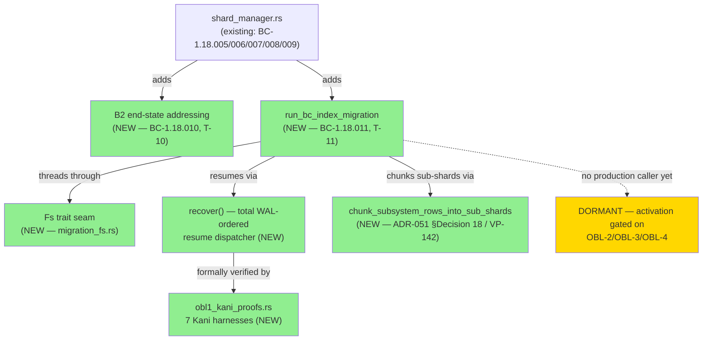
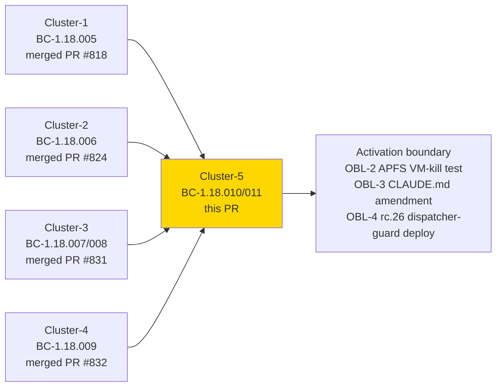
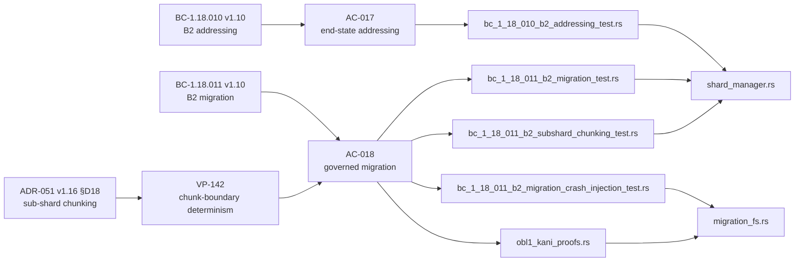

# [S-25.02] Artifact Sharding Layer 2 — Cluster 5: Mechanism B2 End-State Addressing + Governed Migration

**Epic:** S-25.02 — Artifact Sharding Layer 2 (BC-1.18.001..012)
**Mode:** feature (Feature Mode F4, cycle `v1.0-feature-engine-discipline-pass-1`)
**Convergence:** LOCAL adversary cascade CONVERGED across 4 fresh-context passes — pass-1 found a genuine data-loss BLOCKER (`run_bc_index_migration` overwrote the canonical `BC-INDEX.md` with a 4-line stub), pass-2 found 2 HIGH crash-recovery defects (fail-open on a coexisting txn; unimplemented forward recovery), pass-3 found 2 peripheral (1 MED CI-coverage gap, 1 LOW stale-comment), pass-4 CLEAN. Accepted at floor per D-386 Option C (human-approved): novelty decayed from BLOCKER→HIGH→peripheral→zero across the cascade, and crash-recovery correctness is now formally proven (see Verification Package below), so residual novelty is cosmetic, not correctness-bearing.


Implements BC-1.18.010 v1.10 (Mechanism B2 — BC-INDEX per-subsystem body-table sharding with
zero-lookup first-level addressing and manifest-based second-level sub-sharding) and BC-1.18.011
v1.10 (B2's one-time governed migration, crash-recovery, and second-level sub-shard chunking),
covering story Tasks **T-10** (AC-017) and **T-11** (AC-018), plus the second-level sub-shard
chunking amendment from ADR-051 v1.16 §Decision 18 / VP-142. This is the 5th of 7 clusters in the
S-25.02 sequence: cluster-1 (BC-1.18.005, PR #818), cluster-2 (BC-1.18.006, PR #824), cluster-3
(BC-1.18.007/008, PR #831), and cluster-4 (BC-1.18.009, PR #832) are already merged to `develop`.

**The migration ships DORMANT.** `run_bc_index_migration` has no production caller wired into the
dispatcher's gate chain on this branch — activation is deferred to the activation boundary, gated
on three still-open obligations: **[D-1232-OBL-2]** an APFS VM-kill hardware-crash test,
**[D-1232-OBL-3]** a CLAUDE.md amendment documenting the activation runbook, and
**[D-1232-OBL-4]** the rc.26 dispatcher-guard deploy that wires the native admission-gate Bash
leg. Merging this PR is **TDD-completion of the migration mechanism**, not activation of it — the
same "library-only, no production caller yet" scope boundary cluster-3 and cluster-4 already
established for their own mechanisms (see Risk Assessment below). **[D-1232-OBL-1]** — the
crash-recovery correctness obligation — is fully discharged in this PR (formal proof + fault
injection, see Verification Package).

---

## Architecture Changes



<details>
<summary><strong>Architecture Decision Record</strong></summary>

### ADR: Total WAL-ordered `recover()` as the single resume-decision authority (ADR-052 §Decision 12)

**Context:** The B2 migration is a multi-step, crash-interruptible state machine (stage generation
files → write intent WAL → pointer-swap CURRENT.json → clean up). Pass-2 LOCAL adversarial review
found the original resume logic fail-open on a coexisting in-flight transaction and never
implemented forward recovery (`decide_intent_log_recovery` was dead code) — a genuine crash could
leave the migration in an unrecoverable or silently-incorrect state.

**Decision:** Replace the pass-2 arm-patches with a systematic refactor: a new `Fs` trait seam
(`migration_fs.rs`) abstracting every filesystem effect the migration performs, and a single total
`recover()` function that is the sole resume-decision authority — it classifies the on-disk WAL
state via `classify_txn_records` (a full-slice classification, not an incremental patch) and
returns an exhaustive `RecoveryDecision` covering every reachable crash point.

**Rationale:** ADR-052 §Decision 7b already mandated WAL-before-rename; this refactor is
governance-classified REFINES/IMPLEMENTS (no re-ratification needed) — it structurally closes the
fail-open by construction (recover() is total over the WAL's record space) rather than patching
each newly-discovered crash window as adversarial review finds it.

**Alternatives Considered:**
1. Continue patching individual crash-window arms as adversarial passes find them — rejected: this
   is exactly the pattern that produced the pass-2 fail-open (an incremental patch cannot prove
   totality; only a formally-verified total function can).
2. Skip formal verification and rely on fault-injection alone — rejected: fault-injection can prove
   presence of bugs but not absence; Kani's bounded model checking proves `recover()`'s totality and
   fail-closed safety across the full input space CBMC can enumerate within bounds, which
   fault-injection's 30 concrete scenarios cannot.

**Consequences:**
- Every migration call site now threads `Fs` explicitly (sibling-sweep across
  `shard_manager.rs`/`executor.rs`/`main.rs`, TD-VSDD-060).
- `obl1_kani_proofs.rs` adds 7 `#[kani::proof]` harnesses, `#[cfg(kani)]`-gated so they never
  compile in a normal build; a new `.github/workflows/kani.yml` job is the only place they run.
- The repo's pre-existing VP-077 Kani harnesses were found broken (Kani 0.68's `kani::assert`
  signature changed; no Kani CI existed to catch it) and were fixed in the same pass.

</details>

---

## Story Dependencies



All four upstream clusters are already merged to `develop` (`ebd16f79`). Cluster-5 does not modify
any of their shipped mechanisms; it adds B2 addressing and migration as new, additive surface area
in `shard_manager.rs` plus two new modules (`migration_fs.rs`, `obl1_kani_proofs.rs`). No
dispatcher-gate wiring invokes `run_bc_index_migration` on this branch — activation is a separate,
explicitly-gated follow-on (OBL-2/3/4 above), consistent with the same scope-deferral pattern
cluster-3 (T-12) and cluster-4 established for their own mechanisms.

---

## Spec Traceability



| Requirement | Story AC | BC Postcondition | Test | Status |
|-------------|----------|-------------------|------|--------|
| Zero-lookup first-level addressing | AC-017 | BC-1.18.010 v1.10 PC2, VP-127 | `bc_1_18_010_b2_addressing_test.rs` | PASS |
| Manifest-keyed second-level addressing, single-authoritative-row, ARCH-INDEX-sourced mapping | AC-017 | BC-1.18.010 v1.10 PC1/PC4, VP-128 | `bc_1_18_010_b2_addressing_test.rs` | PASS |
| Three-way parity (config/manifest/live ARCH-INDEX SHA) | AC-017 | BC-1.18.010 v1.10 Invariant 2 | `bc_1_18_010_b2_addressing_test.rs` | PASS |
| Second-level sub-shard chunk-boundary determinism (`chunk_subsystem_rows_into_sub_shards`) | AC-018 | BC-1.18.011 v1.10 PC6, VP-142 | `bc_1_18_011_b2_subshard_chunking_test.rs` | PASS |
| Content preservation / census / admission-gate / intent-log | AC-018 | BC-1.18.011 v1.10 | `bc_1_18_011_b2_migration_test.rs` | PASS |
| Crash-atomicity, WAL-ordered recovery, idempotence (systematic, OBL-1) | AC-018 | BC-1.18.011 v1.10, ADR-052 §Decision 12 | `bc_1_18_011_b2_migration_crash_injection_test.rs`, `obl1_kani_proofs.rs` (7 harnesses) | PASS |
| Failpoint reachability smoke coverage | AC-018 | BC-1.18.011 v1.10 | `bc_1_18_011_b2_migration_obl1_failpoint_smoke_test.rs` | PASS |

---

## Verification Package

### [D-1232-OBL-1] DISCHARGED

- **Kani formal verification: 7/7 PROVED.** `crates/factory-dispatcher/src/shard_manager/obl1_kani_proofs.rs` — `recover()` totality, fail-closed safety, transition inductive invariants, `INV-GATE-TXN` admission quiescence, pointer-swap crash-atomicity + WAL ordering, and idempotence. Runs in CI via the new `.github/workflows/kani.yml` (`cargo kani -p factory-dispatcher --harness proof_obl1`, positive-coverage-asserted at `EXPECTED_PROOFS=7` — guards against the substring-filter false-green class an adversary finding (F-C5-P3-001) identified: a partial-match `--harness` filter that silently drops a renamed/moved harness and still exits 0).
- **Fault-injection: 30/30 green.** Systematic crash-injection suite (`bc_1_18_011_b2_migration_crash_injection_test.rs`) exercises every crash boundary via both the `fail` crate and real child-process abort, covering all destructive write sites in the migration state machine.
- **Verification architecture documented:** ADR-052 v1.16→v1.17 §Decision 12 (documentary REFINES/IMPLEMENTS of §Decision 7b — WAL-before-rename was already mandated; this documents how `recover()` structurally satisfies it).

### Local adversarial cascade (4 fresh-context passes, converged)

| Pass | Findings | Severity | Resolution |
|------|----------|----------|------------|
| 1 | `run_bc_index_migration` overwrote canonical `BC-INDEX.md` with a 4-line stub (F-C5-P1-001) | BLOCKER (data-loss) | Fixed — rebuilt lean `BC-INDEX.md` body from original preamble (`ba07c336`), plus 6 more pass-1 findings (F-C5-P1-003/005/006/007) fixed same burst |
| 2 | Fail-open on a coexisting in-flight txn; unimplemented forward recovery (dead `decide_intent_log_recovery`); incomplete staging never discarded | 2 HIGH + 1 MED | Fixed via full systematic OBL-1 discharge — `Fs` trait seam + total WAL-ordered `recover()` (`93ce4fde`/`2257277a`/`cdd9b5f2`..`2ac74914`) |
| 3 | 1 MED (`kani.yml` positive-coverage gap), 1 LOW (stale test comments) | peripheral | Fixed at `fb39c267`/`31eefb58` |
| 4 | 0 findings | — | CLEAN |

Accepted at floor per D-386 Option C (human-approved): all crash-recovery *correctness* findings
were resolved by pass-3, confirmed formally by Kani and empirically by fault-injection; pass-4's
zero findings confirm no residual correctness novelty.

### Full local gate

| Check | Result |
|-------|--------|
| `cargo test -p factory-dispatcher --test bc_1_18_010_b2_addressing_test` | 22/22 green (AC-017) |
| `cargo test -p factory-dispatcher --test bc_1_18_011_b2_migration_test` | 55/55 green (AC-018) |
| `cargo test -p factory-dispatcher --test bc_1_18_011_b2_subshard_chunking_test` | 7/7 green (AC-018 PC6, VP-142) |
| `cargo test --features factory-dispatcher/failpoints --test bc_1_18_011_b2_migration_crash_injection_test -- --test-threads=1` | 30/30 green (OBL-1 fault-injection) |
| `cargo kani -p factory-dispatcher --harness proof_obl1` | 7/7 PROVED (OBL-1 formal verification) |
| `cargo test --workspace --all-targets` | green (full workspace regression suite) |
| `cargo fmt --check --all` | clean |
| `cargo clippy --workspace --all-targets -- -D warnings` | clean |

### Demo evidence

`docs/demo-evidence/S-25.02/cluster-5-b2-sharding/` — 11 VHS clips (5× AC-017, 6× AC-018) + 2
captured raw-output artifacts (`AC-018-kani-proofs-7-of-7.txt`, `AC-018-crash-injection-30-of-30.txt`)
+ README with the full AC→clip→test mapping.

---

## Traceability

| Requirement | Story AC | BC | Verification | Status |
|-------------|---------|-----|---------------|--------|
| B2 end-state addressing | AC-017 | BC-1.18.010 v1.10 | `bc_1_18_010_b2_addressing_test.rs` | PASS |
| B2 governed migration (crash-recovery, WAL, idempotence) | AC-018 | BC-1.18.011 v1.10 | `bc_1_18_011_b2_migration_test.rs` + crash-injection + Kani | PASS |
| Second-level sub-shard chunking | AC-018 | BC-1.18.011 v1.10 PC6 | `bc_1_18_011_b2_subshard_chunking_test.rs` | PASS |
| Verification architecture | — | ADR-051 §Decision 18, ADR-052 §Decision 12 | Kani + proptest | PASS |
| Verification properties | — | VP-127, VP-128, VP-142 | covered by cluster-5 suites | PASS |

---

## Risk Assessment & Deployment

### Blast Radius
- **Systems affected:** `crates/factory-dispatcher` library surface (`shard_manager.rs` +2 new
  submodules) and a new standalone helper in `crates/last-amended-migrate` (`atomic_write.rs`,
  `sync_file_durable`). No dispatcher-gate wiring invokes `run_bc_index_migration` on this branch.
- **User impact if failure occurs:** none in production today — the migration is DORMANT (no
  production caller). Once activated (OBL-2/3/4), a failure surfaces as a fail-loud, formally-proven
  fail-closed error per `recover()`'s Kani-verified totality — never a silent partial migration.
- **Data impact:** none on this branch — no code path invokes `run_bc_index_migration` against real
  `.factory/` artifacts outside this PR's own test suites.
- **Risk Level:** LOW (dormant mechanism, no production entry point wired, formally-verified
  crash-recovery, 30/30 fault-injection, 4-pass adversarial convergence).

### Feature Flags
No feature flag — the migration is inert until the activation boundary (OBL-2/3/4) wires an
invocation point. This is an intentional design choice matching the mechanism's governance gating,
not a substitute for one.

### Activation Boundary (NOT part of this PR)
- **[D-1232-OBL-2]** APFS VM-kill hardware-crash test — validates `F_FULLFSYNC` durability under an
  actual power-loss/VM-kill scenario, not just process-abort fault-injection.
- **[D-1232-OBL-3]** CLAUDE.md amendment documenting the activation runbook.
- **[D-1232-OBL-4]** rc.26 dispatcher-guard deploy wiring the native admission-gate Bash leg
  (ADR-052 §Decision 5c).

---

## AI Pipeline Metadata

<details>
<summary><strong>Pipeline Details</strong></summary>

```yaml
ai-generated: true
pipeline-mode: feature
pipeline-stages:
  spec-crystallization: completed (BC-1.18.010 v1.10, BC-1.18.011 v1.10, ADR-051 v1.16 §Decision 18, ADR-052 v1.17 §Decision 12)
  story-decomposition: completed (AC-017, AC-018 / T-10, T-11)
  tdd-implementation: completed (69/69 cluster-5 tests green)
  formal-verification: completed (Kani 7/7 PROVED, fault-injection 30/30)
  adversarial-review: completed (4 LOCAL passes, converged at floor per D-386 Option C)
  demo-evidence: completed (11 VHS clips + captured proof/fault-injection output + README)
  convergence: accepted at floor (pass-4 CLEAN)
adversarial-passes: 4
```

</details>

---

## Pre-Merge Checklist

- [ ] All CI status checks passing (`ci.yml`: fmt/clippy/test/bats; `kani.yml`: 7/7 OBL-1 proofs)
- [x] Coverage delta is positive (new test files, no test removal)
- [ ] No critical/high security findings unresolved (pending PR-level security-reviewer pass — this
      PR touches a governance-critical migration and `unsafe extern "C"` fcntl usage)
- [x] LOCAL adversarial cascade converged (4 passes, accepted at floor per D-386 Option C, human-approved)
- [x] Demo evidence recorded per-AC (`docs/demo-evidence/S-25.02/cluster-5-b2-sharding/`)
- [x] Dependency PRs (cluster-1 #818, cluster-2 #824, cluster-3 #831, cluster-4 #832) already merged to `develop`
- [ ] Fresh-eyes pr-reviewer PR-diff convergence (this PR)
- [ ] Human merge decision (autonomy-gated per dispatch instructions — do not auto-merge; migration
      ships dormant, activation is a separate future gate)
