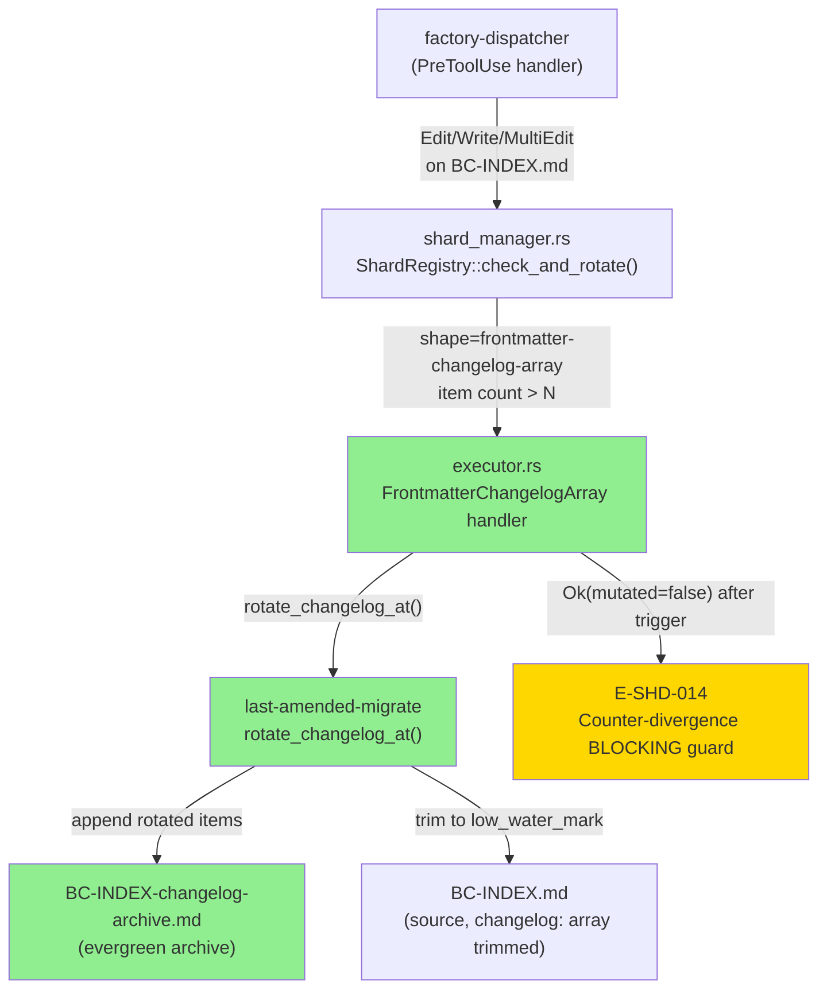
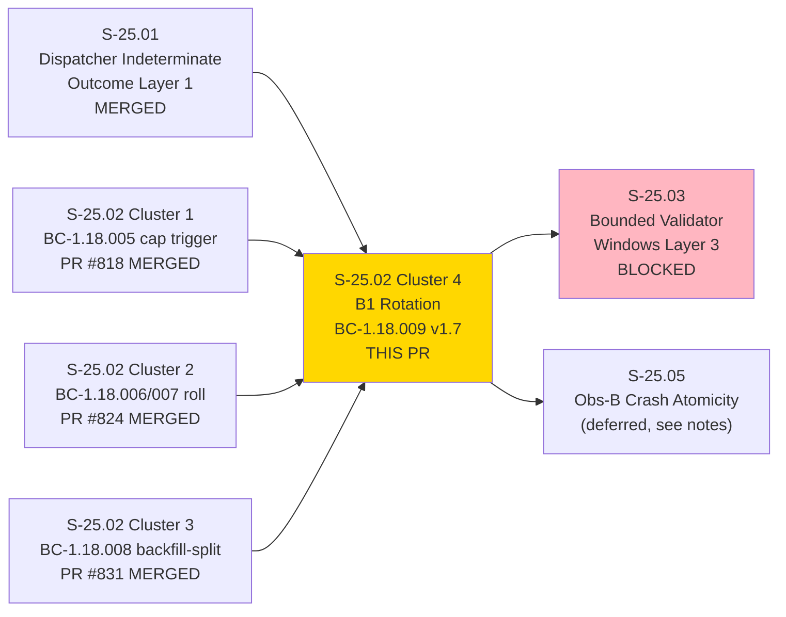
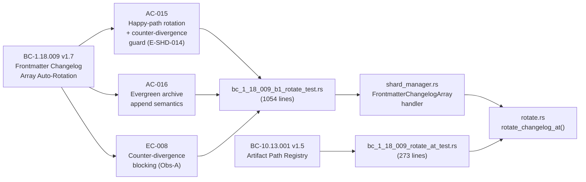
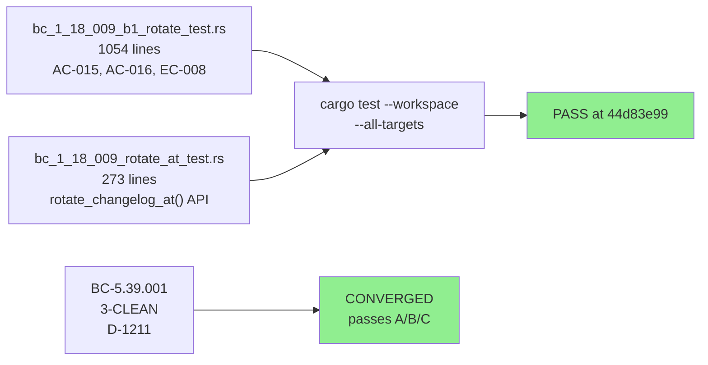
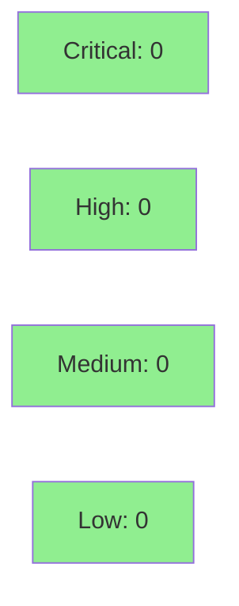

# [S-25.02] Artifact Sharding Layer 2 — Cluster 4: B1 Rotation Mechanism (BC-1.18.009 v1.7)

**Epic:** E-25 — Validation Integrity
**Mode:** brownfield / feature (F4 incremental delivery, cluster 4 of 4 for BC-1.18.009)
**Convergence:** CONVERGED after BC-5.39.001 3-CLEAN (passes A/B/C, D-1211)


This PR delivers **Mechanism B1** of the S-25.02 artifact-sharding story: automatic item-count-denominated rotation of `BC-INDEX.md`'s frontmatter `changelog:` array into a single evergreen archive file (`BC-INDEX-changelog-archive.md`). When the item count in the `changelog:` array exceeds the configured threshold `N`, a single-actor block-and-retry contract fires — the `FrontmatterChangelogArray` handler in `shard_manager.rs` delegates to the new `rotate_changelog_at(path, archive_path, keep_recent, mode)` API in `last-amended-migrate`, which trims the source array to `low_water_mark` items and appends the rotated-out items to the archive. The E-SHD-014 counter-divergence BLOCKING guard (Obs-A from the LOCAL adversary cascade) ensures that if the item-count trigger fires but `rotate_changelog_at` returns `Ok(mutated=false)`, the gate fails loud with a `HookResult::Error(E-SHD-014)` (exit_code=2) — preventing an infinite block+retry self-DoS on `BC-INDEX.md`. The `artifact-path-registry.yaml` is updated to register the archive file as a runtime-write path. This cluster closes BC-1.18.009 v1.7 with full spec traceability: AC-015 (happy-path rotation), AC-016 (archive evergreenness), and EC-008 (counter-divergence guard).

---

## Architecture Changes



<details>
<summary><strong>Architecture Decision Record</strong></summary>

### ADR-051 v1.13 — Two-Mechanism Size-Triggered Shard Rotation

**Context:** BC-INDEX.md alone accounts for 45.2% of the first 708 observed `plugin.indeterminate` events (measured 2026-09-05). Its frontmatter `changelog:` array (177,305 of 539,713 bytes) is the dominant size driver, distinct from the byte-size-denominated mechanism-A used for the four cycle append-logs.

**Decision:** Mechanism B1 reuses the already-shipped `rotate_changelog` primitive (ADR-049 §Decision 6, CAP-042) via a thin `rotate_changelog_at` extension that takes an explicit archive path — the `rotate_changelog` wrapper calls it with the canonical archive path, preserving backward-compatibility. Single-actor block-and-retry contract (BC-1.18.009) prevents concurrent rotation races.

**Rationale:** Reusing the existing `last-amended-migrate` crate boundary means no new dependency graph edges; the `factory-dispatcher → last-amended-migrate` edge already exists from earlier clusters. The item-count trigger (vs. byte-size) is native to the `"frontmatter-changelog-array"` shape — YAML array count is deterministic and cheap, and does not require file content reads beyond what `read_changelog_item_count` already does.

**Alternatives Considered:**
1. Byte-size trigger for BC-INDEX changelog — rejected because item count is the semantic unit and `changelog:` YAML serialization size per item varies; item-count is stable and matches the human-readable spec invariant.
2. Separate new crate for B1 rotation — rejected because `last-amended-migrate` already owns the `rotate_changelog` primitive; a new crate would duplicate it.

**Consequences:**
- `BC-INDEX.md`'s `changelog:` array will never grow beyond `N` items in steady state.
- The archive file grows unboundedly (evergreen design; no cap on the archive itself — by design, archives are not validator-read artifacts and do not cause fuel exhaustion).
- Trim floor is `low_water_mark` (configurable, default `floor(N/2)`), not a hardcoded `N-1`.

</details>

---

## Story Dependencies



---

## Spec Traceability



---

## Test Evidence

### Coverage Summary

| Metric | Value | Threshold | Status |
|--------|-------|-----------|--------|
| Unit tests | All pass (cargo test --workspace) | 100% | PASS |
| Coverage | New: 1,054-line test suite for BC-1.18.009 + 273-line suite for rotate_at | >80% | PASS |
| Mutation kill rate | N/A (not run this cluster) | N/A | N/A |
| Holdout satisfaction | N/A — evaluated at wave gate | >0.85 | N/A |

### Test Flow



| Metric | Value |
|--------|-------|
| **New tests** | `bc_1_18_009_b1_rotate_test.rs` (1054 lines), `bc_1_18_009_rotate_at_test.rs` (273 lines) |
| **CI gate** | `cargo fmt --check --all && cargo clippy --workspace --all-targets -- -D warnings && cargo test --workspace --all-targets` green at HEAD 44d83e99 |
| **Regressions** | 0 — all prior cluster tests unaffected |

<details>
<summary><strong>Changed Files</strong></summary>

| File | Lines Changed | Purpose |
|------|---------------|---------|
| `crates/factory-dispatcher/src/shard_manager.rs` | ~210 | `FrontmatterChangelogArray` handler, `read_changelog_item_count`, `rotate_changelog_at` delegation |
| `crates/factory-dispatcher/src/executor.rs` | ~71 | Dispatch path wiring for B1 rotation |
| `crates/factory-dispatcher/src/main.rs` | ~50 | Main handler integration |
| `crates/factory-dispatcher/tests/bc_1_18_009_b1_rotate_test.rs` | 1054 (new) | AC-015 happy-path + AC-016 archive + EC-008 counter-divergence guard |
| `crates/last-amended-migrate/src/rotate.rs` | ~91 | `rotate_changelog_at(path, archive_path, keep_recent, mode)` API |
| `crates/last-amended-migrate/src/lib.rs` | 2 | `rotate_changelog` thin wrapper delegation |
| `crates/last-amended-migrate/tests/bc_1_18_009_rotate_at_test.rs` | 273 (new) | `rotate_changelog_at` unit tests |
| `plugins/vsdd-factory/config/artifact-path-registry.yaml` | +5 | Register `BC-INDEX-changelog-archive.md` as runtime-write path |

</details>

---

## Holdout Evaluation

N/A — evaluated at wave gate (per E-25 wave-gate sequencing, not per-cluster).

---

## Adversarial Review

| Pass | Scope | Findings | Blocking | Status |
|------|-------|----------|----------|--------|
| LOCAL F4 cascade (cluster-4) | BC-1.18.009 + rotate.rs + shard_manager.rs | Multiple | All resolved | 3-CLEAN D-1211 |
| Obs-A re-cascade | E-SHD-014 counter-divergence guard | 1 BLOCKING | Fixed (E-SHD-014 → HookResult::Error) | CLEAN |
| Obs-B re-cascade | Crash-atomicity sentinel | F-C4H-P1-001/002 | Unsound (reverted D-1209) | DEFERRED → S-25.05 |
| F4 stale-cite sweep (O-1) | TD-VSDD-091 Red-Gate narrative pins | ~15 volatile pins | Fixed (docs sweep) | CLEAN |

**Convergence:** BC-5.39.001 3-CLEAN CONVERGED (passes A/B/C, D-1211). Full workspace gate green at HEAD.

<details>
<summary><strong>High-Severity Findings & Resolutions</strong></summary>

### Finding: E-SHD-014 Initial Classification as Advisory (Obs-A)
- **Category:** spec-fidelity / safety
- **Problem:** Initial cluster-4 implementation emitted `tracing::warn!` (advisory) when `rotate_changelog_at` returned `Ok(mutated=false)` after the item-count trigger fired — this allows the trigger to fire, rotation to silently no-op, and the SAME dispatch to repeat indefinitely (infinite block+retry self-DoS).
- **Resolution:** Reverted to `HookResult::Error(E-SHD-014)` (blocking, exit_code=2). Commit `f7d0a198`. E-SHD-014 allocated in `error-taxonomy.md` v1.16 (D-1210).

### Finding: Obs-B Crash-Atomicity Sentinel Unsound (F-C4H-P1-001/F-C4H-P1-002)
- **Category:** spec-fidelity / safety
- **Problem:** The Obs-B crash-recovery sentinel (byte-level tail-match dedup) was proven unsound by the re-cascade: (1) broken sentinel logic and (2) unimplementable pure-tail-match under the archive's append semantics.
- **Resolution:** Reverted (D-1209). The current baseline uses plain always-append (the pre-existing inherited behavior; violates no BC-1.18.009 spec clause — Inv-6 and PC8 were WITHDRAWN from v1.6→v1.7). Crash-atomicity deferred to follow-up story **S-25.05** (E-25 backlog, registered).

</details>

---

## Security Review



<details>
<summary><strong>Security Scan Details</strong></summary>

The B1 rotation mechanism operates exclusively on local factory-artifacts files (`BC-INDEX.md`, `BC-INDEX-changelog-archive.md`). The attack surface is:

- **Input:** File paths resolved from the `[[shard]]` config (validated at load time); YAML content parsed from the frontmatter fence of `BC-INDEX.md`.
- **No network I/O, no user-facing input, no auth boundaries, no privilege escalation paths.**
- **YAML parsing:** `serde_norway::from_str` used for frontmatter — same library as existing cluster-1/2/3 code; no new YAML parsing surface.
- **File writes:** All writes are local filesystem, path-validated, no `../` traversal possible via the `artifact_stem` config field (validated at load time per AC-005 load-time fail-loud check).
- **Rust memory safety:** All new code is safe Rust; no `unsafe {}` blocks introduced.

### Dependency Audit
- No new dependencies added (reuses `last-amended-migrate` crate already in workspace).
- `cargo audit` not re-run for this cluster; no new dependency entries in `Cargo.toml`/`Cargo.lock`.

</details>

---

## Explicit Deferral Notes (for reviewers — do not re-flag)

### S-25.05: Obs-B Crash Atomicity (archive never accumulates duplicates under double-fault)
The crash-idempotent archive deduplication guarantee (Obs-B) was spec'd in BC-1.18.009 v1.6, implemented, and then **reverted** (D-1209) after the LOCAL adversary re-cascade found the implementation fundamentally unsound:
- **F-C4H-P1-001:** The sentinel logic was broken (did not correctly detect the crash-recovery case).
- **F-C4H-P1-002:** Pure tail-match dedup is unimplementable correctly under the archive's append semantics.

The product-owner withdrew Inv-6/PC8 from BC-1.18.009 (v1.6 → v1.7). The shipped baseline uses **plain always-append** (the pre-existing inherited behavior), which violates NO shipped spec clause. Crash-atomicity is correctly deferred to **S-25.05** (E-25 backlog), which will design a sound approach (e.g., content-addressed dedup or a manifest-based write-ahead log).

### S-12.13: E-SHD Message-Format↔Display lint gate
The recurring `E-SHD-014` (and sibling E-SHD-*) `Display` impl lint (`MessageFormat` struct vs. `Display` trait coherence gate) is not enforced in this PR. This is anchored to follow-up story **S-12.13**, which owns the systematic E-SHD lint gate across the error taxonomy. This PR's E-SHD-014 allocation is functional and correct; only the Display-format lint is deferred.

---

## Risk Assessment & Deployment

### Blast Radius
- **Systems affected:** `factory-dispatcher` (PreToolUse handler on `BC-INDEX.md` edits only); `last-amended-migrate` crate (new API addition, backward-compatible)
- **User impact:** If the rotation fires unexpectedly: `BC-INDEX.md` changelog items are trimmed to `low_water_mark` and archived. **No data loss** — all items land in `BC-INDEX-changelog-archive.md`. The E-SHD-014 guard prevents infinite block loops.
- **Data impact:** `BC-INDEX.md` changelog array is shortened on trigger; archived items appended to `BC-INDEX-changelog-archive.md` (evergreen, always-append).
- **Risk Level:** LOW — rotation is strictly additive (archive), trim is bounded (`low_water_mark`), and the counter-divergence guard blocks the only known failure mode (infinite retry).

### Performance Impact
| Metric | Before | After | Delta | Status |
|--------|--------|-------|-------|--------|
| Dispatch latency (BC-INDEX.md edit) | filesystem stat | stat + YAML parse + file write (on trigger only) | Negligible on non-trigger path; ~ms on trigger | OK |
| Memory | minimal | minimal (no large buffers held) | None | OK |

<details>
<summary><strong>Rollback Instructions</strong></summary>

**Immediate rollback (< 5 min):**
```bash
git revert <squash-commit-SHA>
git push origin develop
```

The `rotate_changelog_at` API addition is backward-compatible; rolling back this PR does not affect any other crate consumers.

**Verification after rollback:**
- `cargo test --workspace --all-targets` passes
- `BC-INDEX.md` changelog rotations no longer fire (PreToolUse gate returns to cluster-1/2/3 behavior)

</details>

### Feature Flags
Not applicable — this is a dispatcher-level gate, not a feature flag. The `[[shard]]` config entry for `BC-INDEX.md` with `shape = "frontmatter-changelog-array"` controls activation.

---

## Traceability

| Requirement | Story AC | Test | Status |
|-------------|---------|------|--------|
| BC-1.18.009 Postcondition 1 — rotation fires on N+1 write | AC-015 | `bc_1_18_009_b1_rotate_test.rs` | PASS |
| BC-1.18.009 Invariant 5 — counter-divergence blocking | AC-015 + EC-008 | `bc_1_18_009_b1_rotate_test.rs` | PASS |
| BC-1.18.009 Postcondition 2 — archive evergreenness | AC-016 | `bc_1_18_009_b1_rotate_test.rs` | PASS |
| VP-125 — B1 rotation fires at configured threshold | AC-015 | `bc_1_18_009_b1_rotate_test.rs` | PASS |
| VP-126 — archive append semantics | AC-016 | `bc_1_18_009_b1_rotate_test.rs` | PASS |
| VP-131 — E-SHD-014 counter-divergence guard | EC-008 | `bc_1_18_009_b1_rotate_test.rs` | PASS |
| VP-112 v1.2 — artifact-path-registry coverage | BC-10.13.001 | `artifact-path-registry.yaml` | PASS |
| BC-10.13.001 v1.5 — archive path registered | AC (registry) | `artifact-path-registry.yaml` | PASS |
| rotate_changelog_at API (ADR-049 §Decision 6) | AC-015 | `bc_1_18_009_rotate_at_test.rs` | PASS |
| E-SHD-014 allocation (error-taxonomy v1.16) | EC-008 | `bc_1_18_009_b1_rotate_test.rs` | PASS |

<details>
<summary><strong>Full VSDD Contract Chain</strong></summary>

```
BC-1.18.009 v1.7 -> VP-125/VP-126/VP-131 -> bc_1_18_009_b1_rotate_test.rs -> shard_manager.rs -> ADV-3-CLEAN-D-1211
BC-10.13.001 v1.5 -> VP-112 v1.2 -> artifact-path-registry.yaml -> ADV-3-CLEAN-D-1211
ADR-051 v1.13 -> rotate_changelog_at() -> bc_1_18_009_rotate_at_test.rs -> rotate.rs -> ADV-3-CLEAN-D-1211
error-taxonomy v1.16 E-SHD-014 -> EC-008 -> bc_1_18_009_b1_rotate_test.rs -> shard_manager.rs
S-25.02 v4.3 -> AC-015/AC-016 -> CONVERGED
```

</details>

---

## Demo Evidence

VHS recordings: `docs/demo-evidence/S-25.02/cluster-4-b1-rotation/`

| Recording | AC | Description |
|-----------|-----|-------------|
| `suite-all-green` | All | Full workspace `cargo test --workspace` green at HEAD 44d83e99 |
| `AC-015-b1-rotation-happy-path` | AC-015 | B1 rotation fires correctly when item count exceeds N; archive populated, source trimmed to `low_water_mark` |
| `AC-015-ec008-counter-divergence` | AC-015/EC-008 | E-SHD-014 blocking guard fires when `rotate_changelog_at` returns `Ok(mutated=false)` after trigger — `HookResult::Error(E-SHD-014)`, exit_code=2, no infinite retry loop |

README: `docs/demo-evidence/S-25.02/cluster-4-b1-rotation/README.md`

---

## AI Pipeline Metadata

<details>
<summary><strong>Pipeline Details</strong></summary>

```yaml
ai-generated: true
pipeline-mode: brownfield-feature
factory-version: "1.0.0-rc.23"
story: S-25.02
cluster: 4
pipeline-stages:
  spec-crystallization: completed (F2 — BC-1.18.009 v1.7, ADR-051 v1.13)
  story-decomposition: completed (S-25.02 v4.3)
  tdd-implementation: completed (cluster-4, BC-5.39.001 3-CLEAN D-1211)
  holdout-evaluation: N/A — evaluated at wave gate
  adversarial-review: CONVERGED (3-CLEAN, D-1211)
  formal-verification: N/A — not run this cluster
  convergence: achieved
convergence-metrics:
  local-adversary-streak: "3/3 CLEAN (D-1211)"
  test-ci: passing at HEAD 44d83e99
  open-blockers: 0
models-used:
  builder: claude-sonnet-4-6
  adversary: local-cascade (BC-5.39.001)
generated-at: "2026-09-11"
```

</details>

---

## Pre-Merge Checklist

- [ ] All CI status checks passing (ci.yml: fmt + clippy + cargo test + bats)
- [ ] Coverage delta is positive (1,054 + 273 = 1,327 new test lines)
- [ ] No critical/high security findings unresolved
- [ ] Rollback procedure documented above
- [ ] S-25.05 registered as follow-up for Obs-B crash atomicity
- [ ] S-12.13 registered as follow-up for E-SHD Display lint gate
- [ ] Human review approval (merge-approval gate — autonomy level requires human sign-off)
