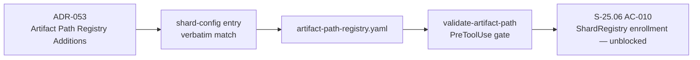

# [S-25.06] Register `shard-config` artifact path pattern

**Epic:** E-25 — Append-Log Artifact Class Sharding
**Mode:** feature (config-only prerequisite)
**Change class:** Mechanical / additive registry entry — no code, no hooks-registry.toml, no binary change

This PR adds a single additive entry to `plugins/vsdd-factory/config/artifact-path-registry.yaml`
registering `artifact_type: shard-config` (canonical path `.factory/shard-config.toml`,
`enforcement_level: block`). It closes the prerequisite for **S-25.06 AC-010** (ShardRegistry
enrollment): without this entry, the `validate-artifact-path` PreToolUse gate rejects any write
to `.factory/shard-config.toml` with `ARTIFACT_PATH_UNREGISTERED`, since the `[[shard]]` registry
consumed by `shard_cap_precheck`/`shard_cap_gate_check` (BC-1.18.005/006) has no canonical path
registered yet.

---

## Architecture Changes

N/A — no architecture change. This PR adds one data row to an existing declarative registry
file (`plugins/vsdd-factory/config/artifact-path-registry.yaml`); no component, module boundary,
or dependency graph is affected. No architecture diagram applies.

---

## Story Dependencies


This PR is a standalone config prerequisite within S-25.06 (E-25). It has no PR-level
dependencies of its own — it does not depend on any other open PR, and no other open PR depends
on it. It unblocks the AC-010 implementation work that follows within the same story.

---

## Spec Traceability



## What changed

```diff
+  - artifact_type: shard-config
+    canonical_path_pattern: ".factory/shard-config.toml"
+    description: "[[shard]] registry consumed by shard_cap_precheck/shard_cap_gate_check (BC-1.18.005/006) — declares every shard-cap-gated artifact, its shape, and its shard_cap_bytes ceiling"
+    enforcement_level: block
```

Byte-identical to the entry specified in **ADR-053 §Artifact Path Registry Additions**
(`.factory/specs/architecture/decisions/ADR-053-story-index-fuel-bounded-sharding.md`), and the
same mechanical shape as the merged precedent PR **#817** (`54fa985f`, `chore(config): register
prd-supplement artifact path pattern`) — a single additive `artifact_type` block appended to the
`artifacts:` list, no other lines touched.

**Explicitly out of scope:** ADR-053's *other* proposed addition
(`artifact_type: story-index-epic-shard`, for `.factory/stories/index/E-{epic-id}.md`) — that
entry belongs to the separate STORY-INDEX sharding migration described in ADR-053, which remains
PROPOSED/paused pending POLICY 22 human ratification. This PR registers only the `shard-config`
path, which is consumed independently by the already-merged, currently-dormant CAP-043 machinery
(BC-1.18.005/006) that S-25.06 AC-010 needs to activate.

---

## Why this is safe

- **Additive only.** No existing registry entry is modified, reordered, or removed. `git diff`
  shows a pure insertion (+5 lines) at the correct alphabetical/thematic position in the
  `artifacts:` list, immediately following the `brownfield-reference-manifest` entry and before
  the `## ── Holdout Evaluations ──` section.
- **No enforcement loosening.** The new entry sets `enforcement_level: block`, the strictest
  level in this registry's vocabulary — it *adds* a governed, enforced path; it does not relax
  any pre-existing gate.
- **Valid YAML / correct section.** Parses cleanly under the same schema as every other
  `artifacts:` entry (4 fields: `artifact_type`, `canonical_path_pattern`, `description`,
  `enforcement_level`), placed under the same top-level `artifacts:` list.
- **No release required.** devops-engineer confirmed via a live probe that
  `validate-artifact-path` reads `artifact-path-registry.yaml` fresh from disk at dispatch time
  (it is data, not a compiled-in constant) — a `develop` merge is sufficient to unblock
  S-25.06 AC-010; no dispatcher binary rebuild/release is needed for this change to take effect.

---

## Risk Assessment

- **Systems affected:** `validate-artifact-path` PreToolUse hook (native Rust WASM), config-only
  input.
- **Blast radius:** Adds exactly one new permitted path pattern
  (`.factory/shard-config.toml`). No existing path pattern is affected; no existing writes can be
  newly blocked by this change.
- **User/data impact:** None — this is factory-internal governance config, not product code or
  product data.
- **Risk Level:** LOW.

## Traceability

| Source | Reference |
|--------|-----------|
| Design spec | ADR-053 §Artifact Path Registry Additions (`shard-config` entry, verbatim) |
| Precedent | PR #817 / commit `54fa985f` — same mechanical shape (single additive registry entry) |
| Consumer | BC-1.18.005 (`shard_cap_precheck`) / BC-1.18.006 (`shard_cap_gate_check`) |
| Unblocks | S-25.06 AC-010 (ShardRegistry enrollment) |

## Demo Evidence

N/A — no user-facing or CLI-observable behavior change to demo. This is a declarative config
addition with no executable code path; there is no AC to visually demonstrate. Per Canonical
Principle Boundaries, demo-recorder is not applicable to a mechanical registry-only change (no
new observable behavior exists to capture on video/GIF). Verification is by direct inspection of
the diff (see "What changed" above) plus CI's regression suite.

## Test Evidence

N/A — config-data-only change with no executable logic. Verification is by inspection: diff
matches ADR-053 verbatim, YAML parses, no other lines touched. CI (fmt/clippy/cargo test/bats)
runs as a regression safety net; no new tests are expected or required for a pure data addition.

## Security Review

N/A — additive `enforcement_level: block` entry to an existing allow-list-style registry. Does
not loosen any existing enforcement, does not introduce new file I/O, network access, or
executable code. See PR comment for the explicit security-reviewer sanity-check confirmation.

## Pre-Merge Checklist

- [ ] All CI status checks passing
- [ ] No security regression (additive `block`-level entry only — confirmed, no loosening of
      existing enforcement)
- [ ] pr-reviewer scoped review clean (single well-formed additive entry, matches ADR-053
      verbatim, valid YAML, correct section, no unintended lines)
- [ ] Human sign-off (self-approval blocked — gh identity == author `Zious11`)
