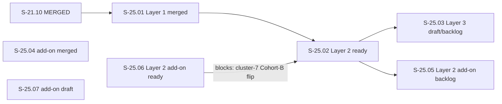

# Epic E-25: Validation Integrity and Large-Artifact Resilience

## Description

E-25 is the epic for the three-layer validation-integrity architecture ratified in ADR-047
(human-ratified 2026-08-30), plus four add-on stories discovered during Layer 2 delivery. It now
holds **7 stories** (corrected 2026-09-25, sibling-gap fix — this narrative had drifted from the
original v1.0 "3-story holding epic" framing across the v1.1/v1.2 story-count growth): the
three-layer core — S-25.01 (Layer 1, MERGED), S-25.02 (Layer 2, READY), S-25.03 (Layer 3,
DRAFT/backlog) — and four Layer-2-adjacent add-on stories discovered during S-25.02's
implementation and adversarial review: S-25.04 (MERGED), S-25.05 (backlog), S-25.06 (READY as of
2026-09-25 — Spec-First Gate S-7.01 closed), and S-25.07 (draft).

**Root problem:** PostToolUse WASM validators run in fuel-bounded and epoch-bounded sandboxes.
Forensic analysis of the dispatcher event log reveals ~11,262 fuel-exhaustion timeouts,
~480 epoch timeouts, 167 host-function OutputTooLarge events, and ~455 events where the
entire validator suite wiped out on a single artifact edit. Because all hooks are PostToolUse
with `failure_policy = "fail-open"` (current default), a non-completing validator is treated
as PASS. **State mutates UNVALIDATED, silently.** This is CWE-754 (Improper Check for
Exceptional Conditions) in the security sense: treating "could not determine" as "confirmed safe."

**Human directive:** The fix is MECHANISTIC — the runtime and data structures enforce integrity.
Never the agent. Agent-side compensation (manual compaction awareness, prose size budgets) is
symptom treatment, not a permanent fix.

### Three-Layer Architecture

**Layer 1 (S-25.01 — MERGED):**
Make "couldn't validate" a first-class, fail-LOUD dispatcher outcome. The INDETERMINATE outcome
class (distinct from PASS/FAIL) is emitted when a plugin cannot complete due to fuel exhaustion,
epoch timeout, or host-function OutputTooLarge. For `failure_policy = "fail-closed"` plugins,
INDETERMINATE writes a durable `.factory/unvalidated-mutation.marker` and blocks the next
state-advancing Agent dispatch and `git commit`/`git push` until the artifact is re-validated.
Existing fail-open plugins (all ~76 current production plugins) are completely unchanged.

**Layer 2 (S-25.02 — READY, W2, deliberate feature-ordering per CLAUDE.md
Canonical Principle §2):**
Continuous size-triggered sharding of append-only cycle artifacts (decision-log, burst-log,
lessons) into capped shards with a shard cap derived from the fuel budget. Removes the
validator-incompletion dark zone BY CONSTRUCTION: no single shard can exceed the
validator-completion envelope.

**Layer 3 (S-25.03 — REGISTERED BACKLOG (draft), deliberate feature-ordering per CLAUDE.md
Canonical Principle §2):**
Validators read BOUNDED WINDOWS from shards rather than whole files. Trusted-boundary-checkpoint
carry-forward for cross-shard invariants. Regression-gate own state-file bounded/rotated +
fail-loud. OutputTooLarge read-path elimination.

**S-25.03 is REGISTERED BACKLOG under E-25 — a feature deliberately ordered after Layer 2 merges,
NOT a tech-debt-register entry. It MUST NOT be silently deferred; it has an explicit story ID and
will be elaborated (BCs authored, specs evolved) when S-25.02 merges. S-25.02 itself has since
progressed to READY (2026-09-25) — see the Stories table below for current status of all 7
stories, including the four Layer-2-adjacent add-ons (S-25.04–S-25.07).**

## Trigger / Motivation

The trigger is the operational forensics documented in the F1 Delta Analysis:
`F1-delta-analysis.md` (v1.0, 2026-08-30, architect). The forensic data:

- ~11,262 `plugin.timeout { cause: Fuel }` events
- ~480 `plugin.timeout { cause: Epoch }` events
- 167 `host_fn_returned_output_too_large` events
- ~455 events where the entire validator suite wiped out on a single artifact edit
- `regression-gate` failed to persist its own state file 22 times (OutputTooLarge)

The pre-Layer-1 pattern of "agent manually avoids large artifacts" is Google SRE toil: manual,
repetitive, automatable, and not yielding permanent improvement. Layer 1+2+3 convert toil into
permanent mechanical guarantees (Google SRE §Chapter 5 — eliminating toil).

Human authorization for E-25 was granted with the delivery of ADR-047 (human-ratified v1.2,
2026-08-30) and the full F2 spec package (BC-1.18.001–004, BC-3.08.001 amendment, VP-102–106,
F1-delta-analysis.md).

## Epic Placement Justification

E-24 is the immediately preceding reserved epic in the index. E-25 is the next free ID under
POLICY 1 (append-only numbering). These validation-integrity issues are logically cohesive —
they all concern the dispatcher's inability to distinguish "validated" from "could not validate"
— and warrant a new epic because they span three subsystems (SS-01, SS-03, SS-04) and introduce
a new WASM plugin crate plus a new ADR. Grouping under E-21 (data-loss hardening) would conflate
write-path integrity with validation-integrity; ADR-047 explicitly extends ADR-039, not ADR-031.

## PRD Capabilities Covered

E-25 delivers CAP-041 across three layers:

**CAP-041 — Validation Integrity: INDETERMINATE Outcome, Durable Mutation Marker, and
Next-Advance Gate** (SS-01 primary; SS-03, SS-04, SS-07 secondary):
- Layer 1 (S-25.01): INDETERMINATE outcome classification + durable marker + next-advance gate
- Layer 2 (S-25.02): Shard-based artifact size bounding (eliminates root cause of INDETERMINATE)
- Layer 3 (S-25.03): Bounded validator windows + regression-gate state-file fix

## Acceptance Criteria

| ID | Criterion | Validation Method |
|----|-----------|-------------------|
| EAC-001 | All three stories S-25.01, S-25.02, S-25.03 shipped and merged to develop within this epic's lifecycle | Story PR merge confirmations |
| EAC-002 | INDETERMINATE outcome emitted for fuel/epoch/OutputTooLarge on fail-closed plugins; durable marker written; next Agent and git commit/push dispatch blocked | cargo test VP-102..VP-106 harness; bats validate-unvalidated-mutation-marker.bats |
| EAC-003 | Marker absent → both gate arms pass; marker rm → both gate arms unblock; successful re-validation → marker deleted | VP-105 bats integration; VP-106 unit-test |
| EAC-004 | Existing fail-open plugins (~76) show zero behavior change; backward-compat guard test preserved and passing | test_BC_1_18_004_fail_open_default_preserves_advisory_behavior (VP-106); full cargo test --workspace --all-targets green |
| EAC-005 | Full bats regression suite (run-all.sh) stays green after Layer 1 lands | plugins/vsdd-factory/tests/run-all.sh |
| EAC-006 | Layer 2 (S-25.02): shard-cap proof — largest shard <= fuel_completion_envelope; no shard exceeds cap (roll-before-write enforced) | To be elaborated when S-25.02 is activated |
| EAC-007 | Layer 3 (S-25.03): validators read only bounded windows; cross-shard checkpoint carry-forward sound for whole-corpus invariants | To be elaborated when S-25.03 is activated |

## Stories

| Story ID | Title | Layer | Wave | Status | Points | BCs |
|----------|-------|-------|------|--------|--------|-----|
| S-25.01 | Dispatcher INDETERMINATE Outcome Layer 1: Fail-Loud on Cannot-Complete — durable marker + next-advance gate | Layer 1 | W1 | merged | 12 | BC-1.18.001, BC-1.18.002, BC-1.18.003, BC-1.18.004, BC-3.08.001 |
| S-25.02 | Artifact Sharding Layer 2: Size-Triggered Shard Rotation for Cycle Artifacts | Layer 2 | W2 | ready | 45 | BC-1.18.005–BC-1.18.012, BC-7.08.001 |
| S-25.03 | Bounded Validator Windows Layer 3: Validators Read from Shards via Bounded Lookups | Layer 3 | TBD (after S-25.02 merges) | draft | ~12 est. | TBD (pending PO authorship at activation) |
| S-25.04 | Close validate-factory-path-staging Zero-Enforcement Gap — Real Layer-1 Production Trigger | E-25 add-on | — | merged | 8 | BC-4.16.002, BC-1.18.001, BC-1.18.004 |
| S-25.05 | Rotate Changelog Crash Atomicity — Proper Cross-File Crash-Atomicity for B1 Archive Boundary | Layer 2 add-on | TBD (after S-25.02 merges) | backlog | 8 | BC-1.18.009 (pending v1.8), BC-10.13.001 (pending v1.6) |
| S-25.06 | Append-Log Artifact Class — Sanctioned Backfill-Split Executor + ShardRegistry Enrollment + Cap-Triggered Rotation | Layer 2 add-on | W3 | ready | 8 | BC-1.18.013 |
| S-25.07 | Revisit BC-1.18.002 INV2/EC-030 Marker-Read I/O-Error Fail-Open Posture | E-25 add-on | — | draft | 8 | BC-1.18.002 (v1.8, existing) |

**Total (current):** 7 stories, ~101 story points (12 + 45 + ~12 est. + 8 + 8 + 8 + 8).

S-25.02 and S-25.03 point estimates are preliminary; they will be refined when stories are
elaborated (BCs authored, architecture sections evolved) at activation time.

**Sequencing rationale:**

- Wave 1 (S-25.01 — 12 pts): Active. `depends_on: [S-21.10]` (S-21.10 MERGED). Delivers
  the INDETERMINATE classification + durable marker + next-advance gate. New WASM plugin crate
  `validate-unvalidated-mutation-marker`. Three Cohort A fail-closed validator assignments.
  Independent of S-21.19–S-21.24 (enforcement seams — full operational effect requires S-21.24
  but Layer 1 is independently deliverable per ADR-047 Integration Ordering Recommendation).

- S-25.02 (READY — 45 pts): `depends_on: [S-25.01]` (S-25.01 MERGED). Delivers the Layer 2
  size-triggered shard rotation. `blocks: [S-25.03]`. Also `blocked_by: [S-25.06]` (S-25.06's
  live one-time backfill must complete before S-25.02's cluster-7 Cohort-B fail-closed flip can
  dispatch — see Dependency Graph below).

- S-25.03 (draft/backlog — ~12 pts est.): REGISTERED BACKLOG. `depends_on: [S-25.02]`. Activated
  when S-25.02 merges. Requires product-owner BC authorship and architect elaboration before
  wave scheduling.

- S-25.06 (READY — 8 pts, W3): `depends_on: []` (mechanism delivered in S-25.02 cluster-3,
  PR #831 MERGED — no unmet story-level prerequisite); `blocks: [S-25.02]` (S-25.02's cluster-7
  Cohort-B fail-closed flip capstone must not dispatch until S-25.06 has executed the live
  backfill against the four append-log files). This is the acyclic representation: S-25.02
  cluster-3 delivers the mechanism (DONE) -> S-25.06 wires + executes it -> S-25.02 cluster-7
  activates.

- S-25.04 (MERGED — 8 pts) and S-25.07 (draft — 8 pts): independent add-on stories with no
  epic-internal story dependency edge.

- S-25.05 (backlog — 8 pts): `depends_on` S-25.02 merging (Layer 2 add-on, same activation
  gating as S-25.03).

## Dependency Graph

S-25.04 and S-25.07 are independent add-on stories with no epic-internal dependency edge (shown
without incoming/outgoing arrows). Acyclic confirmed (topological order:
S-21.10, S-25.01, S-25.06, S-25.04, S-25.07 -> S-25.02 -> S-25.03, S-25.05). The
S-25.06 -> S-25.02 edge is a `blocks` relationship (not a `depends_on`): S-25.06 has no unmet
prerequisite of its own (the mechanism it wires, `run_mechanism_a_backfill_split`, already
merged in S-25.02 cluster-3), but S-25.02's own cluster-7 capstone (the Cohort-B fail-closed
flip) is gated on S-25.06 completing its live backfill execution — see S-25.06 frontmatter
`blocks: [S-25.02]` and BC-1.18.013 Postcondition 7 / Invariant 4.

## Dependencies (External)

| System | Capability Needed | Readiness |
|--------|------------------|-----------|
| S-21.10 (MERGED) | `FailurePolicy` enum + `RegistryEntry.failure_policy` field | COMPLETE — PR #780 merged (S-21.10). S-25.01 builds on this foundation. |
| ADR-039 (ratified v1.16) | `failure_policy` field schema, calibration prerequisites, axes-independence invariant | COMPLETE — ADR-039 is the normative base; ADR-047 extends it. |
| ADR-047 (accepted v1.2, human-ratified) | INDETERMINATE outcome model specification | COMPLETE — human-ratified 2026-08-30. POLICY 22 ratification record pending state-manager decision-log entry (D-NNN). |

## Out of Scope

- **S-21.19–S-21.24 (enforcement seams):** The per-dispatch fail-closed block (failure_policy
  enforcement for the CURRENT dispatch) is S-21.19–S-21.24 scope. Layer 1 delivers the NEXT-
  dispatch marker+gate; full operational effect (current-dispatch block AND next-dispatch gate)
  requires both E-25 Layer 1 AND S-21.24 to merge.

- **fuel-cap increases (ADR-042):** The 10M→20M fuel cap increase is already in production
  (v1.0.0-rc.24). Layer 1 does not require a further fuel cap change; it makes INDETERMINATE
  visible regardless of the configured fuel budget.

- **Compaction/CLAUDE.md size budget prose:** Agent-side compensation for large artifacts is
  retained as secondary mitigation but is explicitly NOT the mechanistic fix this epic delivers.

- **Per-plugin marker files (multiple simultaneous INDETERMINATE events):** The single-marker
  last-writer-wins policy is Layer 1. Layer 3 bounded windows will reduce concurrent
  INDETERMINATE events to near-zero, making per-plugin markers unnecessary.

## Behavioral Contract Traceability

| BC ID | Version | Title (abbreviated) | Capability | Implementing Story |
|-------|---------|---------------------|------------|-------------------|
| BC-1.18.001 | v1.0 | fail-closed cannot-complete → INDETERMINATE, plugin.indeterminate event, durable marker | CAP-041 | S-25.01 |
| BC-1.18.002 | v1.0 | next-advance gate (Agent + git commit/push Bash arms) blocks while marker exists | CAP-041 | S-25.01 |
| BC-1.18.003 | v1.0 | successful re-validation clears marker; idempotent; operator rm escape hatch | CAP-041 | S-25.01 |
| BC-1.18.004 | v1.0 | fail-open INDETERMINATE → advisory event only; no marker; no gate; backward-compat anchor | CAP-041 | S-25.01 |
| BC-3.08.001 | v1.28 | SS-03 event catalog amendment: Event 8 plugin.indeterminate wire format | CAP-041 | S-25.01 |
| BC-TBD (S-25.02) | — | Layer 2 shard-rotation behavioral contracts (pending PO authorship at activation) | CAP-041 | S-25.02 |
| BC-TBD (S-25.03) | — | Layer 3 bounded-window behavioral contracts (pending PO authorship at activation) | CAP-041 | S-25.03 |

## Changelog

| Version | Date | Author | Summary |
|---------|------|--------|---------|
| v1.3 | 2026-09-25 | story-writer | E-25 file-drift reconciliation (same burst as S-25.06 Spec-First Gate closure). S-25.03 Stories-table status corrected `backlog` -> `draft` (STORY-INDEX.md parity — the catalog authority). Dependency Graph mermaid rebuilt: was S-25.01->S-25.02->S-25.03 only, omitting S-25.04/S-25.05/S-25.06/S-25.07; now shows all 7 stories with real edges, including the S-25.06->S-25.02 `blocks` prerequisite (S-25.02's cluster-7 Cohort-B fail-closed flip gated on S-25.06's live backfill completing), S-25.02->S-25.03, S-25.02->S-25.05, and S-25.04/S-25.07 shown independent. Description narrative corrected from the stale v1.0 "3-story holding epic" framing (never updated across the v1.1/v1.2 story-count growth) to the actual 7-story composition; Layer 1/2 status labels in the Three-Layer Architecture subsection corrected (S-25.01 active->MERGED, S-25.02 backlog->READY). S-25.06 Stories-table row status updated `draft` -> `ready` and BCs cell `(pending PO authorship)` -> `BC-1.18.013`, matching its Spec-First Gate S-7.01 closure (BC-1.18.013 v1.1 authored by product-owner; VP-143/144/145 allocated by architect) in this same burst. |
| v1.2 | 2026-09-25 | state-manager | S-25.07 registered (D-1240, post-merge burst for PR #842/S-25.02 cluster-5): human-directed deferral (Canonical Principle Rule 3) re-evaluating BC-1.18.002 v1.8 INV2/EC-030's fail-open posture, following the revert of a fail-closed change to `indeterminate_marker::block_if_marker_check` made during PR #842. S-25.06 BACKFILLED into this table (registered in STORY-INDEX.md at D-1209/2026-09-12 but never propagated to this epic file — sibling-gap fix, TD-VSDD-060 class). story_count corrected 5→7 in one motion. Stories table totals updated to ~101 pts. |
| v1.1 | 2026-09-11 | state-manager | S-25.04 + S-25.05 registered; story_count 3→5. S-25.04 (Close validate-factory-path-staging Zero-Enforcement Gap, 8 pts, MERGED) added. S-25.05 (Rotate Changelog Crash Atomicity — proper B1 cross-file crash-atomicity, 8 pts, BACKLOG) deferred from S-25.02 cluster-4 Obs-B REVERT per D-1209. Stories table totals updated to ~85 pts. |
| v1.0 | 2026-08-30 | story-writer | Initial authoring. E-25 HOLDING EPIC. 3 stories: S-25.01 active (Layer 1, 12 pts), S-25.02 backlog (Layer 2, ~15 pts est.), S-25.03 backlog (Layer 3, ~12 pts est.). CAP-041. ADR-047 (human-ratified). BC-1.18.001–004 + BC-3.08.001 amendment. VP-102–106. |
