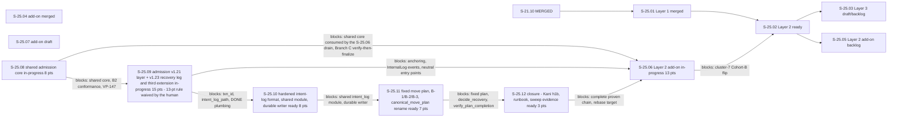

# Epic E-25: Validation Integrity and Large-Artifact Resilience

## Description

E-25 is the epic for the three-layer validation-integrity architecture ratified in ADR-047
(human-ratified 2026-08-30), plus four add-on stories discovered during Layer 2 delivery. It now
holds **12 stories** (v1.8, 2026-10-08; the narrative had drifted from the original v1.0 "3-story
holding epic" framing across the story-count growth): the
three-layer core — S-25.01 (Layer 1, MERGED), S-25.02 (Layer 2, READY), S-25.03 (Layer 3,
DRAFT/backlog) — and nine Layer-2-adjacent add-on stories discovered during S-25.02's
implementation and adversarial review: S-25.04 (MERGED), S-25.05 (backlog), S-25.06 (IN-PROGRESS —
Spec-First Gate S-7.01 closed 2026-09-25; split 2026-10-06), S-25.07 (draft), S-25.08 (IN-PROGRESS —
the shared-admission-core half split out of S-25.06, 2026-10-06), S-25.09 (IN-PROGRESS — the ADR-052 v1.21
layer split out of S-25.08, 2026-10-07; 15 pts by one-time human waiver) and the three-story ADR-054 chain
S-25.10 -> S-25.11 -> S-25.12 (READY; split of one 18-point story by human decision, 2026-10-08).

**Root problem:** PostToolUse WASM validators run in fuel-bounded and epoch-bounded sandboxes.
Forensic analysis of the dispatcher event log reveals ~11,262 fuel-exhaustion timeouts,
~480 epoch timeouts, 167 host-function OutputTooLarge events, and ~455 events where the
entire validator suite wiped out on a single artifact edit. Because all hooks are PostToolUse
with `failure_policy = "fail-open"` (current default), a non-completing validator is treated
as PASS. **State mutates UNVALIDATED, silently.** This is CWE-754 (Improper Check for
Exceptional Conditions) in the security sense: treating "could not determine" as "confirmed safe."

**Human directive:** The fix is MECHANISTIC — the runtime and data structures enforce integrity.
Never the agent. Agent-side compensation (manual compaction awareness, prose size budgets) is
symptom treatment, not a permanent fix.

### Three-Layer Architecture

**Layer 1 (S-25.01 — MERGED):**
Make "couldn't validate" a first-class, fail-LOUD dispatcher outcome. The INDETERMINATE outcome
class (distinct from PASS/FAIL) is emitted when a plugin cannot complete due to fuel exhaustion,
epoch timeout, or host-function OutputTooLarge. For `failure_policy = "fail-closed"` plugins,
INDETERMINATE writes a durable `.factory/unvalidated-mutation.marker` and blocks the next
state-advancing Agent dispatch and `git commit`/`git push` until the artifact is re-validated.
Existing fail-open plugins (all ~76 current production plugins) are completely unchanged.

**Layer 2 (S-25.02 — READY, W2, deliberate feature-ordering per CLAUDE.md
Canonical Principle §2):**
Continuous size-triggered sharding of append-only cycle artifacts (decision-log, burst-log,
lessons) into capped shards with a shard cap derived from the fuel budget. Removes the
validator-incompletion dark zone BY CONSTRUCTION: no single shard can exceed the
validator-completion envelope.

**Layer 3 (S-25.03 — REGISTERED BACKLOG (draft), deliberate feature-ordering per CLAUDE.md
Canonical Principle §2):**
Validators read BOUNDED WINDOWS from shards rather than whole files. Trusted-boundary-checkpoint
carry-forward for cross-shard invariants. Regression-gate own state-file bounded/rotated +
fail-loud. OutputTooLarge read-path elimination.

**S-25.03 is REGISTERED BACKLOG under E-25 — a feature deliberately ordered after Layer 2 merges,
NOT a tech-debt-register entry. It MUST NOT be silently deferred; it has an explicit story ID and
will be elaborated (BCs authored, specs evolved) when S-25.02 merges. S-25.02 itself has since
progressed to READY (2026-09-25) — see the Stories table below for current status of all 12
stories, including the nine Layer-2-adjacent add-ons (S-25.04–S-25.12).**

## Trigger / Motivation

The trigger is the operational forensics documented in the F1 Delta Analysis:
`F1-delta-analysis.md` (v1.0, 2026-08-30, architect). The forensic data:

- ~11,262 `plugin.timeout { cause: Fuel }` events
- ~480 `plugin.timeout { cause: Epoch }` events
- 167 `host_fn_returned_output_too_large` events
- ~455 events where the entire validator suite wiped out on a single artifact edit
- `regression-gate` failed to persist its own state file 22 times (OutputTooLarge)

The pre-Layer-1 pattern of "agent manually avoids large artifacts" is Google SRE toil: manual,
repetitive, automatable, and not yielding permanent improvement. Layer 1+2+3 convert toil into
permanent mechanical guarantees (Google SRE §Chapter 5 — eliminating toil).

Human authorization for E-25 was granted with the delivery of ADR-047 (human-ratified v1.2,
2026-08-30) and the full F2 spec package (BC-1.18.001–004, BC-3.08.001 amendment, VP-102–106,
F1-delta-analysis.md).

## Epic Placement Justification

E-24 is the immediately preceding reserved epic in the index. E-25 is the next free ID under
POLICY 1 (append-only numbering). These validation-integrity issues are logically cohesive —
they all concern the dispatcher's inability to distinguish "validated" from "could not validate"
— and warrant a new epic because they span three subsystems (SS-01, SS-03, SS-04) and introduce
a new WASM plugin crate plus a new ADR. Grouping under E-21 (data-loss hardening) would conflate
write-path integrity with validation-integrity; ADR-047 explicitly extends ADR-039, not ADR-031.

## PRD Capabilities Covered

E-25 delivers CAP-041 across three layers:

**CAP-041 — Validation Integrity: INDETERMINATE Outcome, Durable Mutation Marker, and
Next-Advance Gate** (SS-01 primary; SS-03, SS-04, SS-07 secondary):
- Layer 1 (S-25.01): INDETERMINATE outcome classification + durable marker + next-advance gate
- Layer 2 (S-25.02): Shard-based artifact size bounding (eliminates root cause of INDETERMINATE)
- Layer 3 (S-25.03): Bounded validator windows + regression-gate state-file fix

## Acceptance Criteria

| ID | Criterion | Validation Method |
|----|-----------|-------------------|
| EAC-001 | All three stories S-25.01, S-25.02, S-25.03 shipped and merged to develop within this epic's lifecycle | Story PR merge confirmations |
| EAC-002 | INDETERMINATE outcome emitted for fuel/epoch/OutputTooLarge on fail-closed plugins; durable marker written; next Agent and git commit/push dispatch blocked | cargo test VP-102..VP-106 harness; bats validate-unvalidated-mutation-marker.bats |
| EAC-003 | Marker absent → both gate arms pass; marker rm → both gate arms unblock; successful re-validation → marker deleted | VP-105 bats integration; VP-106 unit-test |
| EAC-004 | Existing fail-open plugins (~76) show zero behavior change; backward-compat guard test preserved and passing | test_BC_1_18_004_fail_open_default_preserves_advisory_behavior (VP-106); full cargo test --workspace --all-targets green |
| EAC-005 | Full bats regression suite (run-all.sh) stays green after Layer 1 lands | plugins/vsdd-factory/tests/run-all.sh |
| EAC-006 | Layer 2 (S-25.02): shard-cap proof — largest shard <= fuel_completion_envelope; no shard exceeds cap (roll-before-write enforced) | To be elaborated when S-25.02 is activated |
| EAC-007 | Layer 3 (S-25.03): validators read only bounded windows; cross-shard checkpoint carry-forward sound for whole-corpus invariants | To be elaborated when S-25.03 is activated |

## Stories

| Story ID | Title | Layer | Wave | Status | Points | BCs |
|----------|-------|-------|------|--------|--------|-----|
| S-25.01 | Dispatcher INDETERMINATE Outcome Layer 1: Fail-Loud on Cannot-Complete — durable marker + next-advance gate | Layer 1 | W1 | merged | 12 | BC-1.18.001, BC-1.18.002, BC-1.18.003, BC-1.18.004, BC-3.08.001 |
| S-25.02 | Artifact Sharding Layer 2: Size-Triggered Shard Rotation for Cycle Artifacts | Layer 2 | W2 | ready | 45 | BC-1.18.005–BC-1.18.012, BC-7.08.001 |
| S-25.03 | Bounded Validator Windows Layer 3: Validators Read from Shards via Bounded Lookups | Layer 3 | TBD (after S-25.02 merges) | draft | ~12 est. | TBD (pending PO authorship at activation) |
| S-25.04 | Close validate-factory-path-staging Zero-Enforcement Gap — Real Layer-1 Production Trigger | E-25 add-on | — | merged | 8 | BC-4.16.002, BC-1.18.001, BC-1.18.004 |
| S-25.05 | Rotate Changelog Crash Atomicity — Proper Cross-File Crash-Atomicity for B1 Archive Boundary | Layer 2 add-on | TBD (after S-25.02 merges) | backlog | 8 | BC-1.18.009 (v1.8 current; S-25.05's own amendment is pending a later version), BC-10.13.001 (v1.5; amendment pending) |
| S-25.06 | Append-Log Artifact Class — Sanctioned Backfill-Split Executor + ShardRegistry Enrollment + Cap-Triggered Rotation | Layer 2 add-on | W3 (after S-25.08) | in-progress | 13 | BC-1.18.013, BC-1.18.011 |
| S-25.07 | Revisit BC-1.18.002 INV2/EC-030 Marker-Read I/O-Error Fail-Open Posture | E-25 add-on | — | draft | 8 | BC-1.18.002 (v1.8, existing) |
| S-25.08 | Shared Admission Core Wired on the Production Path + B2 Conformance (B2-1/B2-3/B2-4) + VP-147 Re-baseline | Layer 2 add-on | W3 (before S-25.09) | in-progress | 8 | BC-1.18.011, BC-1.18.013, BC-7.06.001, BC-1.08.001 |
| S-25.09 | Admission Diagnostics as InternalLog Events + Single Session-Root Anchoring + Closed Verdict Label + Neutral Entry-Point Names (ADR-052 v1.21) | Layer 2 add-on | W3 (after S-25.08, before S-12.16 / S-25.06) | in-progress | 15 (> the 13-pt index rule; WAIVED one-time by the human, 2026-10-07/08 — not split) | BC-1.18.010, BC-1.18.011, BC-1.18.013, BC-3.08.001 |
| S-25.10 | Hardened Intent-Log Format, Shared Module and Durable Writer (ADR-054 Decisions 1 and 4; slice 1 of 3 of the human-authorized ADR-052 amendment 2026-10-08) | Layer 2 add-on | W3 (after S-25.09, before S-25.11) | ready | 8 | BC-1.18.011, BC-1.18.013 |
| S-25.11 | Fixed Canonical-Move Plan, Completion Evidence and the `canonical_move_plan` Rename (ADR-054 Decisions 2 and 3; slice 2 of 3) | Layer 2 add-on | W3 (after S-25.10, before S-25.12) | ready | 7 | BC-1.18.011, BC-1.18.013 |
| S-25.12 | Closure of the ADR-054 Chain - `decide_recovery` Kani Totality (h1b), Hardened Operator Runbook and Sibling-Sweep Evidence (slice 3 of 3) | Layer 2 add-on | W3 (after S-25.11, before S-12.16 / S-25.06) | ready | 3 | BC-1.18.011 |

**Total (current):** 12 stories, ~147 story points (12 + 45 + ~12 est. + 8 + 8 + 13 + 8 + 8 + 15 + 8 + 7 + 3).
S-25.10 / S-25.11 / S-25.12 (2026-10-08) are the THREE-story chain for all of ADR-054, the result of the human's decision of 2026-10-08 to SPLIT the 18-point S-25.10 (originally ONE story for ADR-054, honest 18 points over the 13-point rule) along the story-writer's suggested cut: S-25.10 = log FORMAT (hardened intent-log format, shared module, `Fs` seam, two of the three new exit-2 codes; 8 pts); S-25.11 = PLAN and COMPLETION (fixed `canonical_move_plan` and the rename, B-1/B-2/B-3, `decide_recovery` and `verify_plan_completion`, `CANONICAL_MOVE_HALTED`; 7 pts); S-25.12 = CLOSURE (Kani h1b and `kani.yml` 10 -> 11, runbook, sibling-sweep evidence; 3 pts). 8 + 7 + 3 = 18, the total is unchanged and every story is within the 13-point rule. The chain blocks S-25.06 (via S-25.12) and any `migrate-bc-index` release; release gating remains an OPEN human decision.
S-25.06 was 8 pts at its 2026-09-25 registration, re-estimated 21 pts at its v1.5 (2026-10-06), and split by
human decision (2026-10-06, option (A)) into S-25.06 (13) + S-25.08 (8). S-25.08 (8 pts, unchanged through two adversary
passes) was split by human decision D-1252(f) (2026-10-07; AC-027 stays in S-25.08) into S-25.08 (8) + S-25.09 (5): the +5 is
the pass-2 ADR-052 v1.21 scope growth made visible. S-25.09 then grew again (v1.1, 2026-10-07): the ADR-052 v1.23 layer
(AC-007, +2) and the `migrate-bc-index` recovery leg (AC-008..AC-011, +8, a rewrite rather than residual verification)
re-estimate it to 15, which EXCEEDS the 13-point index rule. **HUMAN WAIVER (human decision 2026-10-07/08; ONE-TIME, this story only):** S-25.09
STAYS at 15 points and is NOT split; the 13-point index rule is WAIVED for it (the state-manager assigns the D-number; the suggested cut
{AC-001..AC-006} 5 / {AC-007} 2 / {AC-008..AC-011} 8, with shared `shard_manager.rs` / `admission.rs` hunks, is declined). The ADR-052 v1.23 third
binary-leg extension (S-25.09 AC-012..AC-018, 2026-10-08) is carried WITHIN the waived 15. The waiver does not change the rule for any other story.

S-25.02 and S-25.03 point estimates are preliminary; they will be refined when stories are
elaborated (BCs authored, architecture sections evolved) at activation time.

**Sequencing rationale:**

- Wave 1 (S-25.01 — 12 pts): Active. `depends_on: [S-21.10]` (S-21.10 MERGED). Delivers
  the INDETERMINATE classification + durable marker + next-advance gate. New WASM plugin crate
  `validate-unvalidated-mutation-marker`. Three Cohort A fail-closed validator assignments.
  Independent of S-21.19–S-21.24 (enforcement seams — full operational effect requires S-21.24
  but Layer 1 is independently deliverable per ADR-047 Integration Ordering Recommendation).

- S-25.02 (READY — 45 pts): `depends_on: [S-25.01]` (S-25.01 MERGED). Delivers the Layer 2
  size-triggered shard rotation. `blocks: [S-25.03]`. Also `blocked_by: [S-25.06]` (S-25.06's
  live one-time backfill must complete before S-25.02's cluster-7 Cohort-B fail-closed flip can
  dispatch — see Dependency Graph below).

- S-25.03 (draft/backlog — ~12 pts est.): REGISTERED BACKLOG. `depends_on: [S-25.02]`. Activated
  when S-25.02 merges. Requires product-owner BC authorship and architect elaboration before
  wave scheduling.

- S-25.08 (IN-PROGRESS — 8 pts, W3, first sub-wave): `depends_on: []` (the merged S-25.02 cluster-5 B2 code
  and cluster-3 mechanism-A algorithm are already on develop); `blocks: [S-25.06]`. Delivers the shared
  admission core wired in `main.rs` (D1/D5/release-on-block), B2-1/B2-3/B2-4, B2 fixture updates and the
  VP-147 B2 obl1 Kani re-baseline. Split out of S-25.06 per human decision 2026-10-06 (option (A)).
  **Corrected v1.8:** `blocks: [S-25.09, S-25.06, S-12.16, S-26.06]` (S-25.09 builds on its shared core; S-25.06 depends on it directly).
- S-25.09 (IN-PROGRESS — 15 pts by one-time human waiver of the 13-point rule, W3, after S-25.08): `depends_on: [S-25.08]` (every AC amends code S-25.08 delivers); `blocks: [S-12.16, S-25.06, S-25.10, S-26.06, S-6.03]`. Delivers the ADR-052 v1.21 layer (single session-root anchoring, InternalLog admission diagnostics, closed verdict label, neutral entry-point names), the `migrate-bc-index` recovery leg and the v1.23 third extension, and the AC-019 `txn_id` / `intent_log_path` plumbing S-25.10 consumes; rebased five times, current tip `f5e603b3` (earlier: `98ef531d`) on S-25.08 `a7fc5930` (earlier: `db671fea`). Split out of S-25.08 per human decision D-1252(f), 2026-10-07.
- S-25.10 (READY — 8 pts, W3, after S-25.09): `depends_on: [S-25.09]` (consumes the `txn_id = activation_id`, persisted-and-read `intent_log_path` and `txn_id` / `fencing_generation` plumbing S-25.09 AC-019 delivers); `blocks: [S-25.11]` (S-25.11 adds the plan/recovery functions to the shared `shard_manager/intent_log.rs` this story creates and calls its reader/writer and the `Fs::append_durable` seam). Keeps the OLD field spelling; owns the format-conversion hunks of `shard_manager.rs` listed in its Scope Boundary table.
- S-25.11 (READY — 7 pts, W3, after S-25.10): `depends_on: [S-25.10]` (additive functions in the shared module, reader/writer, `IntentLogCorrupt`); `blocks: [S-25.12]` (the Kani proof, the runbook and the sweep evidence need the function, the behavior and the rename this story delivers). Owns the plan/completion/rename hunks of `shard_manager.rs`.
- S-25.12 (READY — 3 pts, W3, after S-25.11): `depends_on: [S-25.11]` (h1b proves S-25.11's `decide_recovery`; the runbook documents S-25.11's behavior; the sweep asserts S-25.10/S-25.11's deletions and rename); `blocks: [S-25.06]` (S-25.06 must rebase onto the complete, proven chain; it consumes the shared module, `decide_recovery`, `verify_plan_completion` and the parity fixture, and deletes its own copy at its rebase). Owns no `shard_manager.rs` hunk.
- S-25.06 (IN-PROGRESS — 13 pts, W3, second sub-wave): `depends_on: [S-25.08, S-25.09, S-25.12, S-12.16]` (its drain, Branch C
  verify-then-finalize and VP-146 a4 harness build on S-25.08's shared core; the intent-log format, plan and completion verifier on the S-25.10 -> S-25.11 -> S-25.12 chain, depended on via its last story); `blocks: [S-25.02]`
  (S-25.02's cluster-7 Cohort-B fail-closed flip capstone must not dispatch until S-25.06 has executed the
  live backfill against the four append-log files — a POST-MERGE step). This is the acyclic representation:
  S-25.02 cluster-3/5 delivered the mechanism (DONE) -> S-25.08 delivers the shared core -> S-25.06 wires +
  executes the backfill -> S-25.02 cluster-7 activates.

- S-25.04 (MERGED — 8 pts) and S-25.07 (draft — 8 pts): independent add-on stories with no
  epic-internal story dependency edge.

- S-25.05 (backlog — 8 pts): `depends_on` S-25.02 merging (Layer 2 add-on, same activation
  gating as S-25.03).

## Dependency Graph

```mermaid
graph LR
  S21_10[S-21.10 MERGED]
  S25_01[S-25.01 Layer 1 merged]
  S25_02[S-25.02 Layer 2 ready]
  S25_03[S-25.03 Layer 3 draft/backlog]
  S25_04[S-25.04 add-on merged]
  S25_05[S-25.05 Layer 2 add-on backlog]
  S25_06[S-25.06 Layer 2 add-on in-progress 13 pts]
  S25_10[S-25.10 hardened intent-log format, shared module, durable writer ready 8 pts]
  S25_11[S-25.11 fixed move plan, B-1/B-2/B-3, canonical_move_plan rename ready 7 pts]
  S25_12[S-25.12 closure - Kani h1b, runbook, sweep evidence ready 3 pts]
  S25_07[S-25.07 add-on draft]
  S25_08[S-25.08 shared admission core in-progress 8 pts]
  S25_09[S-25.09 admission v1.21 layer + v1.23 recovery leg and third extension in-progress 15 pts - 13-pt rule waived by the human]

  S21_10 --> S25_01
  S25_01 --> S25_02
  S25_08 -->|blocks: shared core, B2 conformance, VP-147| S25_09
  S25_08 -->|blocks: shared core consumed by the S-25.06 drain, Branch C verify-then-finalize| S25_06
  S25_09 -->|blocks: anchoring, InternalLog events, neutral entry points| S25_06
  S25_09 -->|blocks: txn_id, intent_log_path, DONE plumbing| S25_10
  S25_10 -->|blocks: shared intent_log module, durable writer| S25_11
  S25_11 -->|blocks: fixed plan, decide_recovery, verify_plan_completion| S25_12
  S25_12 -->|blocks: complete proven chain, rebase target| S25_06
  S25_06 -->|blocks: cluster-7 Cohort-B flip| S25_02
  S25_02 --> S25_03
  S25_02 --> S25_05
```

S-25.04 and S-25.07 are independent add-on stories with no epic-internal dependency edge (shown
without incoming/outgoing arrows). Acyclic confirmed (topological order:
S-21.10, S-25.01, S-25.08, S-25.09, S-25.10, S-25.11, S-25.12, S-25.06, S-25.04, S-25.07 -> S-25.02 -> S-25.03, S-25.05; S-25.10 depends_on S-25.09, S-25.11 depends_on S-25.10, S-25.12 depends_on S-25.11 and blocks S-25.06, no cycle). The
S-25.06 -> S-25.02 edge is a `blocks` relationship (not a `depends_on`): S-25.02's own cluster-7
capstone (the Cohort-B fail-closed flip) is gated on S-25.06 completing its live backfill execution — see
S-25.06 frontmatter `blocks: [S-25.02]` and BC-1.18.013 Postcondition 7 / Invariant 4. The
S-25.08 -> S-25.06 edge is S-25.06's `depends_on: [S-25.08]` (S-25.08 `blocks: [S-25.06]`): S-25.06's drain,
verify-then-finalize and VP-146 a4 harness build on the shared admission core S-25.08 delivers. S-25.08 itself
has no unmet prerequisite (the merged B2 code and the mechanism-A algorithm are already on develop).

## Dependencies (External)

| System | Capability Needed | Readiness |
|--------|------------------|-----------|
| S-21.10 (MERGED) | `FailurePolicy` enum + `RegistryEntry.failure_policy` field | COMPLETE — PR #780 merged (S-21.10). S-25.01 builds on this foundation. |
| ADR-039 (ratified v1.16) | `failure_policy` field schema, calibration prerequisites, axes-independence invariant | COMPLETE — ADR-039 is the normative base; ADR-047 extends it. |
| ADR-047 (accepted v1.2, human-ratified) | INDETERMINATE outcome model specification | COMPLETE — human-ratified 2026-08-30. POLICY 22 ratification record pending state-manager decision-log entry (D-NNN). |

## Out of Scope

- **S-21.19–S-21.24 (enforcement seams):** The per-dispatch fail-closed block (failure_policy
  enforcement for the CURRENT dispatch) is S-21.19–S-21.24 scope. Layer 1 delivers the NEXT-
  dispatch marker+gate; full operational effect (current-dispatch block AND next-dispatch gate)
  requires both E-25 Layer 1 AND S-21.24 to merge.

- **fuel-cap increases (ADR-042):** The 10M→20M fuel cap increase is already in production
  (v1.0.0-rc.24). Layer 1 does not require a further fuel cap change; it makes INDETERMINATE
  visible regardless of the configured fuel budget.

- **Compaction/CLAUDE.md size budget prose:** Agent-side compensation for large artifacts is
  retained as secondary mitigation but is explicitly NOT the mechanistic fix this epic delivers.

- **Per-plugin marker files (multiple simultaneous INDETERMINATE events):** The single-marker
  last-writer-wins policy is Layer 1. Layer 3 bounded windows will reduce concurrent
  INDETERMINATE events to near-zero, making per-plugin markers unnecessary.

## Behavioral Contract Traceability

| BC ID | Version | Title (abbreviated) | Capability | Implementing Story |
|-------|---------|---------------------|------------|-------------------|
| BC-1.18.001 | v1.0 | fail-closed cannot-complete → INDETERMINATE, plugin.indeterminate event, durable marker | CAP-041 | S-25.01 |
| BC-1.18.002 | v1.0 | next-advance gate (Agent + git commit/push Bash arms) blocks while marker exists | CAP-041 | S-25.01 |
| BC-1.18.003 | v1.0 | successful re-validation clears marker; idempotent; operator rm escape hatch | CAP-041 | S-25.01 |
| BC-1.18.004 | v1.0 | fail-open INDETERMINATE → advisory event only; no marker; no gate; backward-compat anchor | CAP-041 | S-25.01 |
| BC-3.08.001 | v1.38 | SS-03 event catalog: Event 8 plugin.indeterminate wire format (S-25.01); Events 11-13 `migration.admission_*` InternalLog events and the 64-char InternalLog-only cap (S-25.09) | CAP-041 | S-25.01, S-25.09 |
| BC-1.18.005 | v1.15 | Byte-size-denominated shard-cap formula and native deterministic size trigger | CAP-043 | S-25.02 |
| BC-1.18.006 | v1.12 | Roll-before-write via block-and-retry plus same-invocation atomic shard-index publication | CAP-043 | S-25.02 |
| BC-1.18.007 | v1.2 | Shard retention/compaction | CAP-043 | S-25.02 |
| BC-1.18.008 | v1.10 | Mandatory one-time backfill-split of the four oversized append-logs (algorithm) | CAP-043 | S-25.02 |
| BC-1.18.009 | v1.8 | BC-INDEX frontmatter `changelog:` auto-rotation (mechanism B1) | CAP-043 | S-25.02 (S-25.05 amendment pending a later version) |
| BC-1.18.010 | v1.11 | BC-INDEX per-subsystem body-table sharding (mechanism B2), end-state addressing; §Reader Integration step 1 lstat-first `completed.json` read | CAP-043 | S-25.02 (steps 2-3, Postconditions 1-6), S-25.09 (step 1) |
| BC-1.18.011 | v1.22 | Governed one-time B2 migration; shared admission core, binary legs, hardened intent-log chain | CAP-043 | S-25.02, S-25.06, S-25.08, S-25.09, S-25.10, S-25.11, S-25.12 |
| BC-1.18.012 | v1.1 | Governed one-time B1 changelog backfill migration | CAP-043 | S-25.02 |
| BC-1.18.013 | v1.14 | Governed one-time mechanism-A backfill-split; admission diagnostics, anchoring, coordinator advisories | CAP-043 | S-25.06, S-25.08, S-25.09, S-25.10, S-25.11 |
| BC-7.08.001 | v1.1 | Cohort B fail-closed flip (capstone, cluster 7) | CAP-041 | S-25.02 |
| BC-TBD (S-25.03) | — | Layer 3 bounded-window behavioral contracts (pending PO authorship at activation) | CAP-041 | S-25.03 |

## Changelog

| Version | Date | Author | Summary |
|---------|------|--------|---------|
| v1.8 | 2026-10-08 | story-writer | CONTENT REFRESH (v1.7 was committed; the epic was stale beyond the input-hash). Verified against the eight story files: story_count 12, Total ~147 pts, statuses, points and every `depends_on`/`blocks` edge were already correct and are UNCHANGED. Fixed: (1) Description narrative 8 -> 12 stories (S-25.09..S-25.12 added) and the stale '7 stories' pointer; (2) Sequencing rationale: MISSING S-25.09 bullet added; S-25.08 bullet `blocks` corrected [S-25.06] -> [S-25.09, S-25.06, S-12.16, S-26.06]; (3) mermaid: the wrong direct S-25.10 -> S-25.06 edge replaced by S-25.10 -> S-25.11 -> S-25.12 -> S-25.06, and S-25.08 -> S-25.06 added; (4) Stories table: S-25.09 BCs += BC-1.18.010 (v1.11 §Reader Integration step 1, the lstat-first `completed.json` classification of `detect_migration_read_state`, attributed to S-25.09 by the product-owner) and BC-3.08.001 stays; S-25.05 BC cell corrected (BC-1.18.009 v1.8 exists); (5) Behavioral Contract Traceability table rebuilt with live versions (was BC-3.08.001 v1.28 and two BC-TBD rows); (6) rebase-4 supersession of the SHAs in the v1.7 history rows (`5632964d` -> `0a3745f4`, `efd482d2` -> `2f699e60`; S-25.09 tip `98ef531d`; S-25.08 tip `db671fea`), history rows NOT rewritten; (7) `inputs:` += BC-1.18.010/011/013. |
| v1.7 (round 4, same version, pre-commit) | 2026-10-08 | story-writer | HUMAN SPLIT of S-25.10 (2026-10-08) along the story-writer's suggested cut. S-25.10 retitled 'Hardened Intent-Log Format, Shared Module and Durable Writer' (file name and id kept per POLICY 1), 18 -> 8 pts, `blocks` [S-25.06] -> [S-25.11]. NEW S-25.11 'Fixed Canonical-Move Plan, Completion Evidence and the `canonical_move_plan` Rename' (7 pts, ready, `depends_on` [S-25.10], `blocks` [S-25.12]) and NEW S-25.12 'Closure of the ADR-054 Chain' (3 pts, ready, `depends_on` [S-25.11], `blocks` [S-25.06]). story_count 10 -> 12; Total ~147 pts unchanged (8 + 7 + 3 = 18). Stories table (two new rows, S-25.10 row retitled), Total narrative, Sequencing rationale (three bullets, S-25.06 `depends_on` S-25.12), mermaid (S-25.09 -> S-25.10 -> S-25.11 -> S-25.12 -> S-25.06) and topological-order sentence updated; `inputs:` += S-25.11, S-25.12. S-25.06 `depends_on` S-25.10 -> S-25.12; S-25.09 `blocks` UNCHANGED (still S-25.10). Seam decisions reported: `decide_recovery` the function lives in S-25.11 (B-1/B-2 call it), its Kani proof in S-25.12. Release gating for `migrate-bc-index` stays an OPEN human decision. |
| v1.7 (round 3, same version, pre-commit) | 2026-10-08 | story-writer | ADR-054 propagation (human-authorized ADR-052 amendment, 2026-10-08; D-number assigned by the state-manager). S-25.10 registered (ready; 18 pts honest estimate, exceeds the 13-point index rule, NOT split and NOT waived by the story-writer — the human decides; `depends_on: [S-25.09]`, `blocks: [S-25.06]`; BC-1.18.011 v1.21 primary + BC-1.18.013 v1.13 consumption; VP-133 v1.9 / VP-143 v1.8 / VP-146 v1.5 / VP-147 v1.5). story_count 9 -> 10; Total ~129 -> ~147 pts. Stories table row, Total narrative, Sequencing rationale bullet, mermaid (S-25.09 -> S-25.10 -> S-25.06) and topological-order sentence updated. S-25.09 `blocks` += S-25.10 (scope narrowed to the `txn_id` / `intent_log_path` / DONE plumbing, AC-019, tip `5632964d`); S-25.06 `depends_on` += S-25.10. Release gating for `migrate-bc-index` stays an OPEN human decision. |
| v1.7 | 2026-10-07 | story-writer | S-25.09 re-estimated 5 -> 15 pts: the story grew by the ADR-052 v1.23 layer (AC-007: coordinator `Io` for an unstatable `.factory`, the `migration.admission_failed` `io` and `reservation_release_failed` events, the integrity kinds) and the `migrate-bc-index` recovery leg (AC-008..AC-011: Tier-0 loader, strict-presence decode, `generation_id` tri-state, `ExpiryAbort { arm }`, `FOREIGN_MIGRATION_REFUSED`, `MIGRATION_LOCK_CONTENTION`, the INTERIM `completed.json` short-circuit retired by S-25.06 AC-031). Stories table row 5 -> 15; Total ~119 -> ~129; split narrative and Dependency Graph label updated; `modified[]` re-sequenced (v1.5 before v1.6). 15 exceeds the 13-point index rule and the story is NOT split (round 1 text: 'human decision pending'). **Round 2 (same v1.7, 2026-10-08):** the human WAIVED the 13-point rule one-time for S-25.09 (kept at 15, not split; the state-manager assigns the D-number); the Stories-table points cell, the split narrative and the Dependency Graph label are updated; S-25.09 gains AC-012..AC-018 (ADR-052 v1.23 third binary-leg extension) within the waived 15, S-25.08 gains T-34/T-35, S-25.06 gains AC-036/T-8p. No other story row, status or edge changed. |
| v1.6 | 2026-10-07 | story-writer | S-25.09 registered via the human-decided split of S-25.08 (D-1252(f), 2026-10-07; AC-027 stays in S-25.08): story_count 8 -> 9. Stories table: S-25.09 row added (5 pts, in-progress, W3 after S-25.08, BC-1.18.011 + BC-1.18.013 + BC-3.08.001); S-25.08 row BC cell corrected (+BC-7.06.001, +BC-1.08.001; BC-3.08.001 moved to S-25.09) and wave note updated. Total ~114 -> ~119 pts. Dependency Graph mermaid: S25_09 node, S25_08 -> S25_09 -> S25_06. Sequencing: S-25.08 -> S-25.09 -> S-12.16 -> S-25.06 -> S-25.02 cluster 7. `inputs:` += S-25.09. |
| v1.5 | 2026-10-06 | story-writer | Frontmatter `modified[]` re-sequenced monotonically (v1.3 entry had followed v1.4; POLICY 14 leg 3; all entries preserved). S-25.08 status text READY -> IN-PROGRESS in the Description narrative and Dependency Graph mermaid label (Stories table + STORY-INDEX already carried in-progress). Also corrected the S-25.08 Sequencing-rationale bullet label (READY -> IN-PROGRESS). input-hash recomputed. |
| v1.4 | 2026-10-06 | story-writer | S-25.08 registered via the human-decided split of S-25.06 (2026-10-06, option (A); the v1.5 proposal's S-25.07 ID was already taken). story_count 7 -> 8. Stories table: S-25.08 row added (8 pts, ready, W3 first sub-wave, BC-1.18.011 + BC-1.18.013); S-25.06 row corrected (8 -> 13 pts, ready -> in-progress, BCs += BC-1.18.011). Total ~101 -> ~114 pts. Dependency Graph mermaid + topological order: S-25.08 -> S-25.06 -> S-25.02 (cluster 7); acyclic. Sequencing rationale: S-25.06 bullet updated (`depends_on: [S-25.08]`), S-25.08 bullet added; Description narrative 7 -> 8 stories. |
| v1.3 | 2026-09-25 | story-writer | E-25 file-drift reconciliation (same burst as S-25.06 Spec-First Gate closure). S-25.03 Stories-table status corrected `backlog` -> `draft` (STORY-INDEX.md parity — the catalog authority). Dependency Graph mermaid rebuilt: was S-25.01->S-25.02->S-25.03 only, omitting S-25.04/S-25.05/S-25.06/S-25.07; now shows all 7 stories with real edges, including the S-25.06->S-25.02 `blocks` prerequisite (S-25.02's cluster-7 Cohort-B fail-closed flip gated on S-25.06's live backfill completing), S-25.02->S-25.03, S-25.02->S-25.05, and S-25.04/S-25.07 shown independent. Description narrative corrected from the stale v1.0 "3-story holding epic" framing (never updated across the v1.1/v1.2 story-count growth) to the actual 7-story composition; Layer 1/2 status labels in the Three-Layer Architecture subsection corrected (S-25.01 active->MERGED, S-25.02 backlog->READY). S-25.06 Stories-table row status updated `draft` -> `ready` and BCs cell `(pending PO authorship)` -> `BC-1.18.013`, matching its Spec-First Gate S-7.01 closure (BC-1.18.013 v1.1 authored by product-owner; VP-143/144/145 allocated by architect) in this same burst. |
| v1.2 | 2026-09-25 | state-manager | S-25.07 registered (D-1240, post-merge burst for PR #842/S-25.02 cluster-5): human-directed deferral (Canonical Principle Rule 3) re-evaluating BC-1.18.002 v1.8 INV2/EC-030's fail-open posture, following the revert of a fail-closed change to `indeterminate_marker::block_if_marker_check` made during PR #842. S-25.06 BACKFILLED into this table (registered in STORY-INDEX.md at D-1209/2026-09-12 but never propagated to this epic file — sibling-gap fix, TD-VSDD-060 class). story_count corrected 5→7 in one motion. Stories table totals updated to ~101 pts. |
| v1.1 | 2026-09-11 | state-manager | S-25.04 + S-25.05 registered; story_count 3→5. S-25.04 (Close validate-factory-path-staging Zero-Enforcement Gap, 8 pts, MERGED) added. S-25.05 (Rotate Changelog Crash Atomicity — proper B1 cross-file crash-atomicity, 8 pts, BACKLOG) deferred from S-25.02 cluster-4 Obs-B REVERT per D-1209. Stories table totals updated to ~85 pts. |
| v1.0 | 2026-08-30 | story-writer | Initial authoring. E-25 HOLDING EPIC. 3 stories: S-25.01 active (Layer 1, 12 pts), S-25.02 backlog (Layer 2, ~15 pts est.), S-25.03 backlog (Layer 3, ~12 pts est.). CAP-041. ADR-047 (human-ratified). BC-1.18.001–004 + BC-3.08.001 amendment. VP-102–106. |
