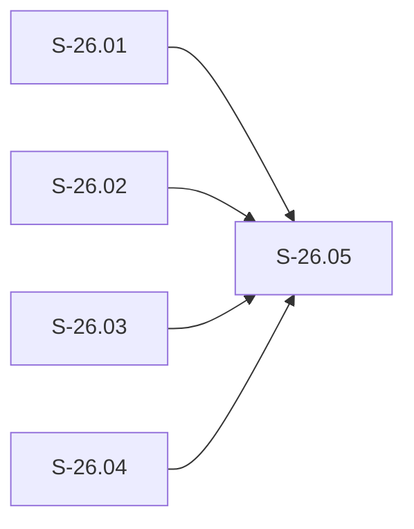

# Epic E-26: Post-rc.25 Hook Hardening

## Description

E-26 collects four defects and two carried-forward release items surfaced by live
operation of the vsdd-factory plugin at `1.0.0-rc.25` against the `jira-cli` product,
all filed as GitHub issues on 2026-09-19. The batch splits along two axes:

**AXIS 1 — Deployment drift (no new code required):**

1. **#837 — `validate-dispatch-advance` misreads Phase-Progress IDs as decisions
   (deployment drift, no new code):** The guard's `<D-\d+>`-shaped decision-ID scanner
   matches `<STATUS>-YYYY-MM-DD` Phase-Progress row IDs as false-positive decision
   references. The fix (word-boundary rule closing the "RC25-RELEASED-2026
   false-positive class" + `scan_max_decision_log_id` Decisions-Log scope narrowing in
   `crates/hook-plugins/validate-dispatch-advance/src/lib.rs`) is **already merged to
   `develop`** at commit `9a1d971b` (2026-09-05) — 2 commits ahead of the rc.25 tag.
   Source and deployed bundle have drifted; resolution is "ship the next release," not
   new implementation work.

**AXIS 2 — Genuine current-source defects (0 commits since the rc.25 tag; source ==
deployed; each is a real code fix), unified by one defect class — a hook deciding
from the wrong or over-broad signal, or over-policing writes/dispatches it should
allow:**

2. **#839 (P0) — `stamp-state-timestamp` PostToolUse mutation races the single-Write
   protocol:** `stamp-state-timestamp` re-stamps STATE.md's `timestamp:` field
   *after* an agent's full-content `Write` lands, mutating the file under an in-flight
   write. A subsequent single-Write attempt by the same agent is refused ("file
   changed since read"), forcing the agent into sequential `Edit` calls — exactly the
   pattern the single-Write protocol (BC-4.17.001 / BC-5.40.001) exists to forbid. Two
   guards land in direct tension with each other.

3. **#840 (P1) — `validate-factory-path-staging` false-positives on the raw command
   string instead of actual staged paths:** The guard raises
   `FactoryPathOnProductBranch` when zero factory paths are staged (branch=`develop`
   triggers on presence of a path *token* in a command string, not on `git diff
   --cached --name-only` reality), including blocking a `gh issue create` call whose
   body merely *mentioned* a `.factory/` path.

4. **#838 (P1) — `pr-manager-completion-guard` lacks dispatch-mode awareness and
   stop-loops:** The guard (a) injects a false `AUTHORIZE_MERGE=yes` on dispatches
   that explicitly said not to merge; (b) re-blocks identically without evaluating the
   agent's `STEP_COMPLETE`/handback output, causing repeated-attempt stop-loops (one
   observed case required 4 attempts before the agent was killed); (c) forces the
   full 9-step new-PR lifecycle onto merge-only or create-only dispatch modes.

**PLUS two related items folded in at human direction:**

5. **Deprecated-hook removal — `verify-state-timestamp-refresh` crate deletion:**
   ADR-046 §Decision 5 retired this guard's `hooks-registry.toml` entry and migrated
   its behavioral contract content to BC-4.17.001 (Stage 1, already shipped), while
   explicitly anticipating a "follow-up crate-deletion story" (Stage 2) that was never
   created. E-26 creates that story: drop the crate from the Cargo workspace, `git rm`
   it, sweep the 2 stale doc-comment references it leaves in `factory-lock-parse` and
   `verify-factory-lock`, and retire BC-5.40.001's VP rows T-001..T-007 as historical
   per POLICY 1 append-only (already directed by ADR-046 §Decision 5's reconciliation
   table — not a new decision).

6. **Fuel-cap release carry:** `DEFAULT_FUEL_CAP`'s 20M raise (ADR-042) is merged to
   `develop` but not yet effective at the operator level — the rc.25 bundle still
   embeds the 10M cap, so large cycle artifacts (burst-log.md, lessons.md, large
   specs) continue to exhaust fuel and detonate the PostToolUse validator fleet. This
   item rides the rc.26 release vehicle; per ADR-042 itself, the 20M raise is
   palliative — size budgets and compaction remain the actual remedy, not a fix E-26
   claims to complete.

**Release vehicle:** rc.26 ships AXIS-1 (#837) + all three AXIS-2 code fixes (#838,
#839, #840) + the deprecated-hook removal + the fuel-cap raise, in a single release. A
release alone (with zero new code) would close only #837 — the other three issues and
the removal require the code fixes in S-26.01..S-26.04 to land on `develop` first.

**Scope discipline (Canonical Principle):** every story below closes its issue in full
in the cycle it ships — no MVP-scoped partial fixes, no "advisory-only" dispatch-mode
detection deferred to a follow-up. Where a fix requires a BC amendment, the story says
so explicitly and stays `status: draft` until product-owner lands that amendment
(Spec-First Gate, S-7.01) — this is not a scope reduction, it is the correct ordering
of spec-before-code.

## Trigger / Motivation

Four GitHub issues (#837, #838, #839, #840) filed 2026-09-19, all observed live
against the `jira-cli` product running the vsdd-factory plugin at `1.0.0-rc.25`.
Human-directed planning/authoring dispatch (2026-09-19) explicitly scoped to
epic + story-stub creation only — no implementation, no STATE.md phase/current_step
changes, no interaction with the paused cluster-5 / POLICY-22 work, no spec/index
version bumps (state-manager registers this epic and its stories in a follow-on
dispatch).

## Epic Placement Justification

E-25 is the most recently authored epic (Validation Integrity and Large-Artifact
Resilience; `status: draft`, unrelated three-layer dispatcher/sharding scope). E-26 is
the next free ID under POLICY 1 (append-only numbering; `E-20` is separately reserved
per the E-21 precedent note — `.factory/stories/STORY-INDEX.md` confirmed no `E-26`
row and no epic file at `.factory/stories/epics/E-26-*.md` at time of creation
2026-09-19; highest existing epic file on disk was `E-25-validation-integrity.md`).
E-26 is logically distinct from every open epic — it is a live-operator-report-driven
hook-hardening batch, not a continuation of E-25's dispatcher/sharding architecture or
the F5 engine-discipline pass-1 cycle — so it is given its own cycle id
(`v1.0-feature-post-rc25-hook-hardening`) rather than folding into either, mirroring
the precedent E-25 itself set (`v1.0-feature-validation-integrity-layer1`) for a
self-contained batch with its own release vehicle.

`depends_on: []` — none of E-26's four defects or two carried items require any other
epic's work to be in-progress or gated; all four hook plugins (`stamp-state-timestamp`,
`validate-factory-path-staging`, `pr-manager-completion-guard`, plus the dormant
`verify-state-timestamp-refresh`) already exist on `develop` today.

## PRD Capabilities Covered

No new PRD capabilities. E-26 fixes defects in existing hook-plugin capabilities and
retires one dormant capability's implementing crate. BC amendments are REQUIRED but
NOT YET AUTHORED — each is called out in the owning story below and must land
(product-owner) before that story's `status` may advance from `draft` to `ready`
(Spec-First Gate, S-7.01):

- **BC-4.17.001** (`stamp-state-timestamp`) — amendment needed for S-26.01 (#839):
  either a PC/invariant governing PostToolUse-vs-in-flight-Write ordering, or a
  postcondition change moving the stamp to a point that cannot race the agent's own
  write.
- **BC-4.16.001** (`validate-factory-path-staging`) — amendment needed for S-26.02
  (#840): gate predicate corrected from raw-command-string-scan + branch-name to
  actual staged `.factory/`-tree paths (`git diff --cached --name-only`).
- **BC-7.03.045 / BC-7.03.046 / BC-7.03.047 / BC-7.03.048**
  (`pr-manager-completion-guard`) — amendment needed for S-26.03 (#838): dispatch-mode
  taxonomy (merge-only / create-only / full-lifecycle), an explicit prohibition on
  asserting `AUTHORIZE_MERGE` not present in the dispatch, and a rule requiring the
  guard to parse the agent's prior `STEP_COMPLETE`/handback output before re-blocking.
- **BC-5.40.001** — reconciliation needed for S-26.04 (removal): VP rows T-001..T-007
  retire from active to historical per ADR-046 §Decision 5's own reconciliation table
  (this is a directed action, not a new PO decision).

## Acceptance Criteria

| ID | Criterion | Validation Method | Test Scenarios |
|----|-----------|-------------------|----------------|
| EAC-001 | All five stories S-26.01..S-26.05 shipped and merged to `develop` (S-26.01..S-26.04) or completed (S-26.05, the release act itself) within this epic's cycle | All story PRs CI-green and merged; rc.26 tag cut and published | S-26.01..S-26.05 PR merge confirmations + rc.26 GitHub Release |
| EAC-002 | `stamp-state-timestamp` no longer mutates STATE.md under an agent's in-flight single-content `Write` | Regression test reproducing #839's race (agent issues single-content Write while stamper is PostToolUse-armed) | S-26.01 AC test suite (to be defined once BC-4.17.001 amendment lands) |
| EAC-003 | `validate-factory-path-staging` raises `FactoryPathOnProductBranch` only when `git diff --cached --name-only` shows at least one staged path under `.factory/`; zero false-positives on command strings that merely mention a `.factory/` path token | Regression test reproducing #840's `gh issue create` false-positive + a zero-staged-factory-path negative control | S-26.02 AC test suite (to be defined once BC-4.16.001 amendment lands) |
| EAC-004 | `pr-manager-completion-guard` never injects `AUTHORIZE_MERGE=yes` absent from the originating dispatch, and re-blocks only after parsing the agent's own `STEP_COMPLETE`/handback output for genuine incompleteness | Regression test reproducing #838's stop-loop (4-attempt case) + a merge-only-mode dispatch negative control | S-26.03 AC test suite (to be defined once BC-7.03.04x amendment lands) |
| EAC-005 | `verify-state-timestamp-refresh` crate is absent from the Cargo workspace and from disk; zero remaining references outside historical changelog/audit-trail prose (POLICY 1 carve-out) | `cargo metadata` workspace-member absence check + `grep -rn verify-state-timestamp-refresh` sweep excluding changelog/superseded/decision-log paths | S-26.04 AC test suite |
| EAC-006 | rc.26 release ships all of #837 (AXIS-1) + #838/#839/#840 fixes (AXIS-2) + the crate removal + the fuel-cap raise, in that dependency order | Release checklist cross-referencing all four issue numbers + removal + ADR-042 cite in the CHANGELOG and GitHub Release notes | S-26.05 AC test suite |

## Stories

| Story ID | Title | Wave | Points | Closes Issue | BCs (pending PO amendment) |
|----------|-------|------|--------|--------------|----------------------------|
| S-26.01 | `stamp-state-timestamp` PostToolUse mutation races single-Write protocol (P0) | W1 | 8 | #839 | BC-4.17.001, BC-5.40.001 |
| S-26.02 | `validate-factory-path-staging` false-positives on raw-string/branch-name instead of staged paths | W1 | 5 | #840 | BC-4.16.001 |
| S-26.03 | `pr-manager-completion-guard` dispatch-mode awareness + stop-loop fix | W1 | 8 | #838 | BC-7.03.045, BC-7.03.046, BC-7.03.047, BC-7.03.048 |
| S-26.04 | Remove dormant `verify-state-timestamp-refresh` crate (ADR-046 §Decision 5 Stage 2) | W1 | 3 | — (ADR-046 follow-up, no GH issue) | BC-5.40.001 (VP retirement only) |
| S-26.05 | Cut rc.26 release (ships #837 + AXIS-2 batch + removal + fuel-cap) | W2 | 3 | #837 (release alone); full batch requires S-26.01..S-26.04 merged first | — (release-process story, no BC) |

**Total:** 5 stories, 27 story points.

> **Maintenance tally drift-check:** Compute story count + points from the 5 linked
> story frontmatters and assert equals the Stories-table totals (5 / 27); run at every
> epic amendment.

**Sequencing rationale:**

- **Wave 1 (S-26.01, S-26.02, S-26.03, S-26.04):** All four are independent of each
  other — three separate hook-plugin crates (`stamp-state-timestamp`,
  `validate-factory-path-staging`, `pr-manager-completion-guard`) plus one crate
  deletion (`verify-state-timestamp-refresh`) that touches no code any of the other
  three depend on. S-26.01 is P0 (active safety/usability defect: it forces agents off
  the single-Write protocol on every STATE.md edit). S-26.02 and S-26.03 are P1. All
  four can run fully in parallel within W1; each is gated individually on its own BC
  amendment landing first (Spec-First Gate) before its own `status` may advance past
  `draft`.

- **Wave 2 (S-26.05):** The release story depends on ALL FOUR Wave-1 stories having
  merged to `develop` — `depends_on: [S-26.01, S-26.02, S-26.03, S-26.04]` — because
  rc.26 is the vehicle for the whole batch, not just the AXIS-1 deployment-drift fix.
  Per the human-provided sequencing directive: "land AXIS-2 code fixes + removal on
  develop FIRST, then cut rc.26." A release cut before all four merge would ship a
  bundle that still contains three of the four current-source defects and the dormant
  crate, silently under-delivering against the batch's own stated scope — the
  Canonical Principle's "no MVP-scoped partial fixes" applies to the release act
  itself, not only to individual stories.

## Dependency Graph

S-26.01, S-26.02, S-26.03, and S-26.04 are mutually independent W1 nodes; all four
gate S-26.05. No cycles. Acyclic confirmed.

Topological order: W1 {S-26.01, S-26.02, S-26.03, S-26.04} (any order, fully
parallel-eligible) → W2 {S-26.05}.

## Dependencies (External)

| System | Capability Needed | Readiness |
|--------|------------------|-----------|
| None | E-26 is self-contained within the vsdd-factory codebase (`crates/hook-plugins/`, `crates/factory-dispatcher/`, `plugins/vsdd-factory/`). No external systems, APIs, or third-party services are required. | N/A |

## Out of Scope

- **AXIS-1 (#837) new implementation work:** The fix is already merged to `develop`
  (commit `9a1d971b`, 2026-09-05). E-26 does not re-implement it; S-26.05 (the release
  story) is what closes #837, by shipping the already-merged commit in rc.26.

- **Fuel-cap root remedy (size budgets / compaction automation):** ADR-042's 20M raise
  is a palliative release-carry item (folded into S-26.05), not a fix for the
  underlying large-cycle-artifact-size problem. The actual remedy — compaction and
  size-budget enforcement — remains tracked under S-15.03 PRIORITY-A per the existing
  Factory Hook Diagnostics table (CLAUDE.md) and is explicitly out of scope for E-26.

- **BC amendment authorship itself:** Story-writer (this epic's producer) does not
  author BC content. Each of S-26.01/S-26.02/S-26.03/S-26.04 documents the specific BC
  amendment its fix requires; landing that amendment is product-owner's routed work,
  dispatched by the orchestrator in a follow-on burst — not part of this
  planning/authoring pass.

- **`.factory/policies.yaml` amendment:** No policy in the registry names any of the
  four affected hook plugins by hook name in a way that would need updating for these
  fixes (mirrors ADR-046 §Decision 5 item 5's own finding for the removal). If a
  future review surfaces one, it is a separate follow-up, not part of E-26.

## Behavioral Contract Traceability

| BC ID | Story | Status |
|-------|-------|--------|
| BC-4.17.001 | S-26.01 (`stamp-state-timestamp` PostToolUse-vs-single-Write race, #839) | Amendment REQUIRED — not yet authored |
| BC-5.40.001 | S-26.01 (mid-burst TTL renewal interaction, secondary) + S-26.04 (VP rows T-001..T-007 retire to historical per ADR-046 §Decision 5) | S-26.01 leg: amendment REQUIRED; S-26.04 leg: directed reconciliation, no new decision needed |
| BC-4.16.001 | S-26.02 (`validate-factory-path-staging` staged-path gating, #840) | Amendment REQUIRED — not yet authored |
| BC-7.03.045 | S-26.03 (`pr-manager-completion-guard`, #838) | Amendment REQUIRED — not yet authored |
| BC-7.03.046 | S-26.03 (`pr-manager-completion-guard`, #838) | Amendment REQUIRED — not yet authored |
| BC-7.03.047 | S-26.03 (`pr-manager-completion-guard`, #838) | Amendment REQUIRED — not yet authored |
| BC-7.03.048 | S-26.03 (`pr-manager-completion-guard`, #838) | Amendment REQUIRED — not yet authored |

Story BC-table rows use abbreviated titles for cell fit; the BC file H1 remains the
sole authoritative title (POLICY 7); abbreviations are non-normative.

## Changelog

| Version | Date | Author | Change |
|---------|------|--------|--------|
| v1.0 | 2026-09-19 | story-writer | Initial creation. Planning/authoring-only dispatch (human-directed). 5 stories S-26.01..S-26.05 spanning SS-01/SS-04/SS-05. 2 waves; 27 pts. No new PRD capabilities. BC-4.17.001, BC-4.16.001, BC-7.03.045..048 amendments flagged for PO routing (S-26.01/S-26.02/S-26.03); BC-5.40.001 directed reconciliation flagged for S-26.04. |
